.. raw:: html

    

      
      
    

Zebrafish pigementation
=======================

In our previous zebrafish tutorial, we have shown how **dynamo** goes
beyond discrete RNA velocity vectors to continous RNA vector field
functions. In this tutorial, we will demonstrate a set of awesome
downsgtream differential geometry and dynamical systems based analyses,
enabled by the differentiable vector field functions, to gain deep
functional and predictive insights of cell fate transition during
zebrafish pigementation (Saunders, et al. 2019).

With differential geometry analysis of the continous vector field
fuctions, we can calculate the **RNA Jacobian** (see our `primer on
differential
geometry <https://dynamo-release.readthedocs.io/en/latest/Primer.html>`__),
which is a **cell by gene by gene** tensor, encoding the gene regulatory
network in each cell. With the Jacobian matrix, we can further derive
the **RNA acceleration, curvature**, which are **cell by gene**
matrices, just like gene expression dataset.

In general (see figure below), we can perform differential analyses and
gene-set enrichment analyses based on top-ranked acceleration or
curvature genes, as well as the top-ranked genes with the strongest
self-interactions, top-ranked regulators/targets, or top-ranked
interactions for each gene in individual cell types or across all cell
types, with either raw or absolute values with the Jacobian tensor.
Integrating that ranking information, we can build regulatory networks
across different cell types, which can then be visualized with ArcPlot,
CircosPlot, or other tools.

In this tutorial, we will cover following topics:

-  learn contionus RNA velocity vector field functions in different
   spaces (e.g. umap or pca space)
-  calculate RNA acceleration, curvature matrices (**cell by gene**)
-  rank genes based on RNA velocity, curvature and acceleration matrices
-  calculate RNA Jacobian tensor (**cell by gene by gene**) for genes
   with high PCA loadings.
-  rank genes based on the jacobian tensor, which including:
-  rank genes with strong postive or negative self-interaction
   (``divergence`` ranking)
-  other rankings, ranking modes including ``full_reg``, ``full_eff``,
   ``eff``, ``reg`` and ``int``
-  build and visualize gene regulatory network with top ranked genes
-  gene enrichment analyses of top ranked genes
-  visualize Jacobian derived regulatory interactions across cells
-  visualize gene expression, velocity, acceleration and curvature
   kinetics along pseudotime trajectory
-  learn and visualize models of cell-fate transitions

Import relevant packages

.. code:: ipython3

    # !pip install dynamo-release --upgrade --quiet
    
    import dynamo as dyn
    
    # set white background
    dyn.configuration.set_figure_params(background='white') 
    
    import matplotlib.pyplot as plt 
    import numpy as np 
    import pandas as pd
    from gseapy.plot import barplot, dotplot
    
    import warnings
    warnings.filterwarnings('ignore')

.. parsed-literal::

    /Users/xiaojieqiu/opt/anaconda3/envs/test/lib/python3.9/site-packages/tqdm/auto.py:21: TqdmWarning: IProgress not found. Please update jupyter and ipywidgets. See https://ipywidgets.readthedocs.io/en/stable/user_install.html
      from .autonotebook import tqdm as notebook_tqdm

Set the logging level. Various logging level can be setted according to
your needs:

-  DEBUG: useful for dynamo development, show all logging information,
   including those debugging information
-  INFO: useful for most dynamo users, show detailed dynamo running
   information
-  WARNING: show only warning information
-  ERROR: show only exception or error information
-  CRITICAL: show only critical information

.. code:: ipython3

    %matplotlib inline
    from dynamo.dynamo_logger import main_info, LoggerManager
    LoggerManager.main_logger.setLevel(LoggerManager.INFO)

Load processed data or data preprocessing
~~~~~~~~~~~~~~~~~~~~~~~~~~~~~~~~~~~~~~~~~

If you followed the **zebrafish pigmentation** tutorial, you can load
the processed zebrafish adata object. Also, you can start from scratch
using the following code.

.. code:: ipython3

    adata = dyn.sample_data.zebrafish()
    adata

.. parsed-literal::

    |-----> Downloading data to ./data/zebrafish.h5ad

.. parsed-literal::

    AnnData object with n_obs × n_vars = 4181 × 16940
        obs: 'split_id', 'sample', 'Size_Factor', 'condition', 'Cluster', 'Cell_type', 'umap_1', 'umap_2', 'batch'
        layers: 'spliced', 'unspliced'

.. code:: ipython3

    adata = dyn.sample_data.zebrafish()
    
    preprocessor = dyn.pp.Preprocessor(cell_cycle_score_enable=True)
    preprocessor.config_monocle_recipe(adata)
    preprocessor.filter_cells_by_outliers_kwargs["keep_filtered"] = True
    preprocessor.preprocess_adata_monocle(adata)
    
    dyn.tl.dynamics(adata, cores=3)
    
    dyn.tl.reduceDimension(adata)
    dyn.tl.cell_velocities(adata)
    
    dyn.tl.cell_velocities(adata)
    dyn.pl.streamline_plot(adata, color=['Cell_type'])

.. parsed-literal::

    |-----> Downloading data to ./data/zebrafish.h5ad
    |-----> Running monocle preprocessing pipeline...
    |-----------> filtered out 14 outlier cells
    |-----------> filtered out 12746 outlier genes
    |-----> PCA dimension reduction
    |-----> <insert> X_pca to obsm in AnnData Object.
    |-----> computing cell phase...
    |-----> [Cell Phase Estimation] completed [4.9645s]
    |-----> [Cell Cycle Scores Estimation] completed [0.2311s]
    |-----> [Preprocessor-monocle] completed [2.3065s]
    |-----> dynamics_del_2nd_moments_key is None. Using default value from DynamoAdataConfig: dynamics_del_2nd_moments_key=False
    |-----------> removing existing M layers:[]...
    |-----------> making adata smooth...
    |-----> calculating first/second moments...
    |-----> [moments calculation] completed [19.7981s]
    |-----> retrieve data for non-linear dimension reduction...
    |-----> [UMAP] using X_pca with n_pca_components = 30
    |-----> <insert> X_umap to obsm in AnnData Object.
    |-----> [UMAP] completed [14.7580s]
    |-----> incomplete neighbor graph info detected: connectivities and distances do not exist in adata.obsp, indices not in adata.uns.neighbors.
    |-----> Neighbor graph is broken, recomputing....
    |-----> Start computing neighbor graph...
    |-----------> X_data is None, fetching or recomputing...
    |-----> fetching X data from layer:None, basis:pca
    |-----> method arg is None, choosing methods automatically...
    |-----------> method ball_tree selected
    |-----> [calculating transition matrix via pearson kernel with sqrt transform.] in progress: 100.0000%|-----> [calculating transition matrix via pearson kernel with sqrt transform.] completed [3.9327s]
    |-----> [projecting velocity vector to low dimensional embedding] in progress: 100.0000%|-----> [projecting velocity vector to low dimensional embedding] completed [0.5575s]
    Using existing pearson_transition_matrix found in .obsp.
    |-----> [projecting velocity vector to low dimensional embedding] in progress: 100.0000%|-----> [projecting velocity vector to low dimensional embedding] completed [0.5458s]
    |-----------> plotting with basis key=X_umap
    |-----------> skip filtering Cell_type by stack threshold when stacking color because it is not a numeric type

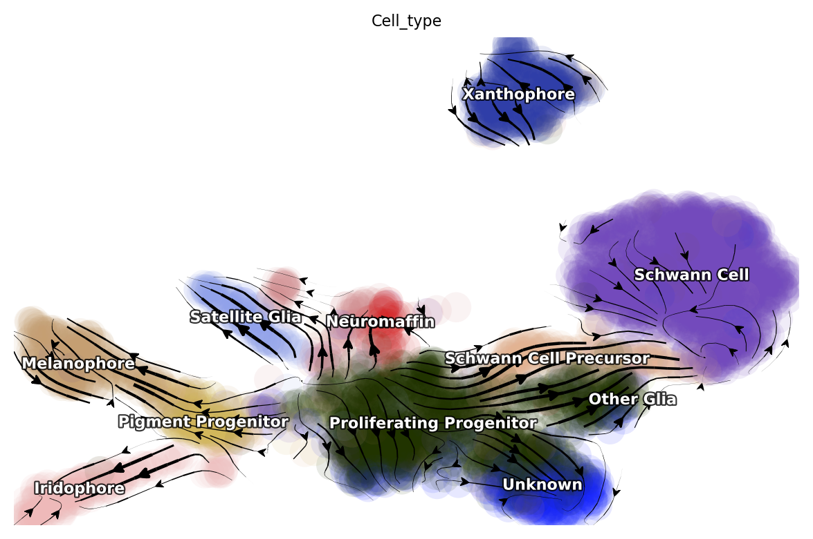

Differential geometry analysis
~~~~~~~~~~~~~~~~~~~~~~~~~~~~~~

In this part we will demonstrate how to leverage **dynamo** to estimate
RNA jacobian (reveals state-dependent regulation), RNA
acceleration/curvature (reveals earlier drivers and fate decision
points), etc.

To gain functional and biological insights, we can perform a series of
downstream analysis with the computed differential geometric quantities.
We can first rank genes across all cells or in each cell group for any
of those differential geometric quantities, followed by gene set
enrichment analyses of the top ranked genes, as well as regulatory
network construction and visualization.

The differential geometry and dynamical systems (i.e. fixed points,
nullclines, etc mentioned in the previous zebrafish tutorial) are
conventionally used to describe small-scale systems, while the vector
field we build comes from high-dimensional genomics datasets. From this,
you can appreciate that with **dynamo**, we are bridging small-scale
systems-biology/physics type of thinking with high-dimensional genomics
using ML, something really unimaginable until very recently!

In order to calculate RNA jacobian, acceleration and curvature, we can
either learn the vector field function directly in the gene expression
space or on the PCA space but then project the differential geometric
quantities learned in PCA space back to the original gene expression
space. Since we often have thousands of genes, we generally learn vector
field in PCA space to avoid the curse of dimensionality and to improve
the efficiency and accuracy of our calculation.

Vector field learning in PCA space
^^^^^^^^^^^^^^^^^^^^^^^^^^^^^^^^^^

To learn PCA basis based RNA velocity vector field function, we need to
first project the RNA velocities into PCA space.

.. code:: ipython3

    dyn.tl.cell_velocities(adata, basis='pca');

.. parsed-literal::

    Using existing pearson_transition_matrix found in .obsp.
    |-----> [projecting velocity vector to low dimensional embedding] in progress: 100.0000%|-----> [projecting velocity vector to low dimensional embedding] completed [0.6055s]

Then we will use the ``dyn.vf.VectorField`` function to learns the
vector field function in PCA space. This function relies on
`sparseVFC <https://www.sciencedirect.com/science/article/pii/S0031320313002410>`__
to learn the high dimensional vector field function in the entire
expression space from sparse single cell velocity vector samples
robustly.

Note that if you don’t provide any basis, vector field will be learned
in the original gene expression and you can learn vector field for other
basis too, as long as you have the RNA velocities projected in that
basis.

Related information for the learned vector field are stored in adata.

.. code:: ipython3

    dyn.vf.VectorField(adata, 
                       basis='pca', 
                       M=100)

.. parsed-literal::

    |-----> VectorField reconstruction begins...
    |-----> Retrieve X and V based on basis: PCA. 
            Vector field will be learned in the PCA space.
    |-----> Learning vector field with method: sparsevfc.
    |-----> [SparseVFC] begins...
    |-----> Sampling control points based on data velocity magnitude...
    |-----> [SparseVFC] completed [0.1007s]
    |-----> [VectorField] completed [0.1855s]

Velocity, acceleration and curvature ranking
^^^^^^^^^^^^^^^^^^^^^^^^^^^^^^^^^^^^^^^^^^^^

To gain functional insights of the biological process under study, we
design a set of ranking methods to rank gene’s absolute, positive,
negative vector field quantities in different cell groups that you can
specify. Here we will first demonstrate how to rank genes based on their
velocity matrix.

Basically, the rank functions in the vector field submodule (**vf**) of
**dynamo** is organized as **rank\_**\ {quantities}**_genes*\* where
{quantities} can be any differential geometry quantities, including,
**velocity, divergence, acceleration, curvature, jacobian**:

-  dyn.vf.rank_velocity_genes(adata, groups=‘Cell_type’)
-  dyn.vf.rank_divergence_genes(adata, groups=‘Cell_type’)
-  dyn.vf.rank_acceleration_genes(adata, groups=‘Cell_type’)
-  dyn.vf.rank_curvature_genes(adata, groups=‘Cell_type’)
-  dyn.vf.rank_jacobian_genes(adata, groups=‘Cell_type’)

Gene ranking for different quantities (except ``jacobian``, see below)
are done based on both their raw and absolute velocities for each cell
group when ``groups`` is set or for all cells if it is not set.

.. code:: ipython3

    dyn.vf.rank_velocity_genes(adata, 
                               groups='Cell_type', 
                               vkey="velocity_S");

Ranking results are saved in ``.uns`` with the pattern
**rank\_**\ {quantities}\_\ **genes** or
**rank_abs\_**\ {quantities}**_genes*\* where ``{quantities}`` can be
any differential geometry quantities and the one with ``_abs`` indicates
the ranking is based on absolute values instead of raw values.

We can save the speed ranking information to ``rank_speed`` or
``rank_abs_speed`` for future usages if needed.

.. code:: ipython3

    rank_speed = adata.uns['rank_velocity_S'];
    rank_abs_speed = adata.uns['rank_abs_velocity_S'];

Next we use\ ``dyn.vf.acceleration`` to compute acceleration for each
cell with the learned vector field in adata. Note that we use PCA basis
to calculate acceleration, but ``dyn.vf.acceleration`` will by default
project ``acceleration_pca`` back to the original high dimension
gene-wise space. You can check the resulted adata which will have both
acceleration (in ``.layers``) and ``acceleration_pca`` (in ``.obsm``).
We can also rank acceleration in the same fashion as what we did to
velocity.

.. code:: ipython3

    dyn.vf.acceleration(adata, basis='pca')

.. parsed-literal::

    |-----> [Calculating acceleration] in progress: 100.0000%|-----> [Calculating acceleration] completed [0.1130s]

.. code:: ipython3

    dyn.vf.rank_acceleration_genes(adata, 
                                   groups='Cell_type', 
                                   akey="acceleration", 
                                   prefix_store="rank");
    rank_acceleration = adata.uns['rank_acceleration'];
    rank_abs_acceleration = adata.uns['rank_abs_acceleration'];

Similarly, we can also use ``dyn.vf.curvature`` to calculate curvature
for each cell with the reconstructed vector field function stored in
adata. ``dyn.vf.rank_curvature_genes`` ranks genes based on their raw or
absolute curvature values in different cell groups.

.. code:: ipython3

    dyn.vf.curvature(adata, basis='pca');

.. parsed-literal::

    |-----> [Calculating acceleration] in progress: 100.0000%|-----> [Calculating acceleration] completed [0.1051s]
    |-----> [Calculating curvature] in progress: 100.0000%|-----> [Calculating curvature] completed [0.1327s]

.. code:: ipython3

    dyn.vf.rank_curvature_genes(adata, groups='Cell_type');

Now we estimated ``RNA acceleration`` and ``RNA curvature``, we can
visualize the acceleration or curvature for individual genes just like
what we can do with gene expression or velocity, etc.

Let us show the ``velocity`` for gene ``tfec`` and ``pnp4a``. ``bwr``
(blue-white-red) colormap is used here because velocity has both
positive and negative values. The same applies to ``acceleration`` and
``curvature``.

.. code:: ipython3

    dyn.pl.umap(adata, color=['tfec', 'pnp4a'], layer='velocity_S', frontier=True)

.. parsed-literal::

    |-----------> plotting with basis key=X_umap

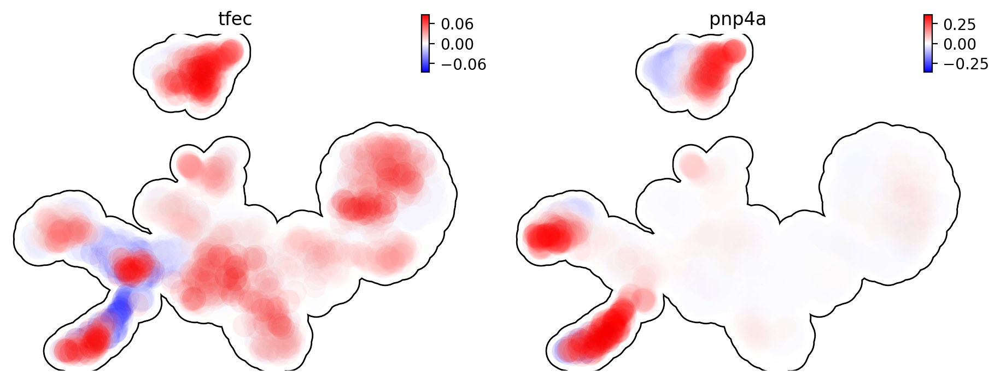

This is for acceleration of genes ``tfec`` and ``pnp4a``.

.. code:: ipython3

    dyn.pl.umap(adata, color=['tfec', 'pnp4a'], layer='acceleration', frontier=True)

.. parsed-literal::

    |-----------> plotting with basis key=X_umap

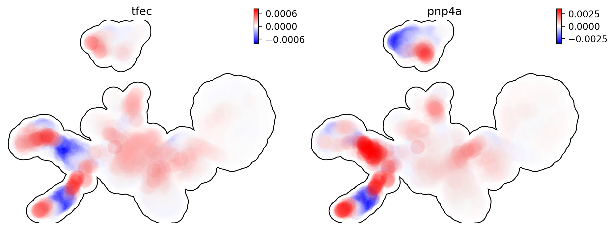

This is for curvature of genes ``tfec`` and ``pnp4a``.

.. code:: ipython3

    dyn.pl.umap(adata, color=['tfec', 'pnp4a'], layer='curvature', frontier=True)

.. parsed-literal::

    |-----------> plotting with basis key=X_umap

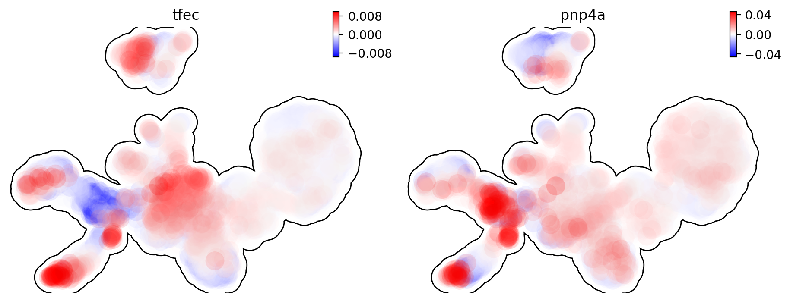

The purpose for us to develop vaious differential geometry analyses is
to derive **functional predictions**. So let us work on this a little
bit next.

Gene set enrichment
'''''''''''''''''''

In this ection, we show our first approach to reveal functional insights
with the ``dyn.ext.enrichr`` function implemented in **dynamo**, a
python wrapper for Enrichr, to identify biological pathways with
statistical significance.

We noticed that the previous study (Saunders, et al. 2019) reported a
“unknown” cell type from their conventional markers based cell-typing
method based on total RNA expression levels. We wonder whether we can
unveil its cell-type identify with **dynamo**. Therefore, we perform
gene set enrichment analysis with the top-ranked genes with the highest
absolute acceleration from this previously “unknown” cell type.
Interestingly, we found the genes were enriched in chondrocyte-related
pathways, indicative of a potential chondrocytic origin.

.. code:: ipython3

    enr = dyn.ext.enrichr(adata.uns['rank_abs_acceleration']['Unknown'][:250].to_list(), organism='Fish', outdir='./enrichr', gene_sets='GO_Biological_Process_2018')

.. code:: ipython3

    dotplot(enr.res2d, title='abs acceleration ranking', cmap='viridis_r', cutoff=0.1)

.. parsed-literal::

    <Axes: title={'center': 'abs acceleration ranking'}, xlabel='Combined Score'>

Jacobian Calculation and Ranking
^^^^^^^^^^^^^^^^^^^^^^^^^^^^^^^^

Next we will calculate Jacobian for each cell with the reconstructed
vector field. If we use PCA space, ``dyn.vf.jacobian`` can project the
low dimension Jacobian results back to high dimension to get a cell by
gene by gene tensor. You can check the ``jacobian_gene`` key from the
``.uns["jacobian_pca"]`` dictionary in the resulted adata object to
confirm this.

The cell by gene by gene tensor is generally huge, especially for
datasets with large number of cells. We thus would love to do some
preprocessing to alleviate the burden of computational resource
requirements, either by restricting the calculation to genes that have
high loading in our pca analysis or by downsampling the cells that will
be used to calculate the ``jacobian matrix`` in each cell.

For the first one, we will use ``dyn.pp.top_pca_genes`` to calculate
``top_pca_genes`` for adata, according to PCs loading in ``adata.uns``.
Note that ``n_top_genes`` below means we take the union of genes with
top **n** absolute values for each principal components, so the
resulting PCA genes may be larger than 100.

For the second one, we can use the following parameters in
``dyn.vf.jacobian``.

.. code:: python

   sampling=None,
   sample_ncells=1000,

When the sampling is choosen from one of the
``'random', 'velocity', 'trn'``, the function will sample
``sample_ncells`` accord to the sampling method ``sample`` for the
Jacobian matrix calculation in only ``sample_ncells`` sampled cells. We
recommend **dynamo** users to start considering sampling cells with your
adata object with more than 2500 cells while the top pca gene selected
will be around 500.

.. code:: ipython3

    dyn.pp.top_pca_genes(adata, n_top_genes=100);

Select top pca genes (flagged in ``top_pca_genes`` in ``.var`` after
running ``pp.top_pca_genes``) and use those genes to set the
regulator/effectors that are necessary in cell-wise ``jacobian matrix``
calculation.

.. code:: ipython3

    top_pca_genes = adata.var.index[adata.var.top_pca_genes];

Here we will ensure a set of the chondrocyte-related gene included in
the Jacobian calculation so that we can visualize the regulatory network
for those genes. You can include other set of genes you care about as
long as they are genes used for pca dimension reduction, that is
``adata[:, genes].var.use_for_pca`` are all ``True``.

.. code:: ipython3

    top_pca_genes = ["erbb3b", "col6a3", "vwa1", "slc35c2", "col6a2", "col6a1"] + list(top_pca_genes)

.. code:: ipython3

    dyn.vf.jacobian(adata, regulators=top_pca_genes, effectors=top_pca_genes);

.. parsed-literal::

    Transforming subset Jacobian: 100%|████████| 4181/4181 [00:11<00:00, 375.53it/s]

We can take advantage of the cell-wise ``jacobian matrix`` to
investigate gene regulation at single-cell resolution or a
state-dependent fashion.

In iridophore cells, we found that ``pnp4a`` was potentially activated
by ``tfec`` in the progenitors of iridophore lineage which is in line
with that reported in Petratou et al. 2021. Futhermore, there seem to
have a possible repression occurring when tfec expression level was high
in the mature iridophore cells.

We can visualize the regulation from ``tfec`` to ``pnp4a``
(:math:`\frac{\partial f_{pnp4a}}{\partial f_{tfec}}`) on the umap
embedding. :math:`\frac{\partial f_{pnp4a}}{\partial f_{tfec}}` denotes
the effects of changing the expression of ``tfec`` to the velocity of
``pnp4a``.

.. code:: ipython3

    dyn.pl.jacobian(adata, regulators=['tfec'], effectors=['pnp4a'], basis='umap')

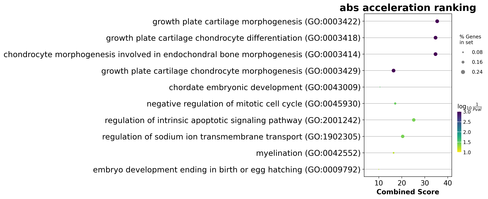

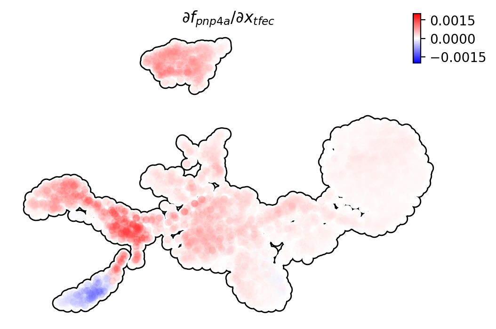

Similarly, we can also visualize the regulation from ``tfec`` to
``pnp4a`` (:math:`\frac{\partial f_{pnp4a}}{\partial f_{tfec}}`) on top
of the gene expression level of ``tfec`` (*x-axis*) to ``pnp4a``
(*y-axis*).

.. code:: ipython3

    dyn.pl.jacobian(adata, regulators=['pnp4a'], effectors=['tfec'], x='tfec', y="pnp4a", layer='M_s', basis='umap')

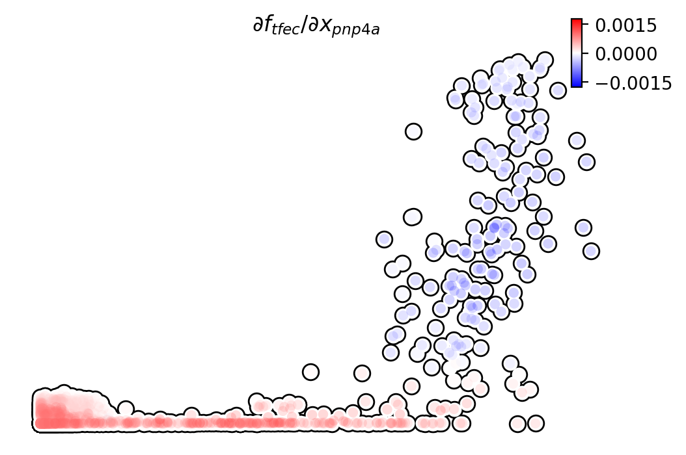

Ranking for Jacobian matrices
'''''''''''''''''''''''''''''

After estimating the cell-wise Jacobian matrix, we now demonstrate
different ways to rank genes based on the Jacobian matrix with
**dynamo**.

We start with the so-called “divergence” ranking for each cell group.
The “divergence” we are talking about here is different from the
definition of ``divergence`` which is basically the sum of the diagonal
elements of the Jacobian. Instead the ``divergence`` in this context
points to the self-activation or self-inhibition terms.

The results of divergence ranking are stored in
``adata.uns['rank_div_gene_jacobian_pca']``.

.. code:: ipython3

    divergence_rank = dyn.vf.rank_divergence_genes(adata, groups='Cell_type');

We can rank all other elements in the Jacobian. There are 5 parameters
we provide in ``dyn.vf.rank_jacobian_genes``\ ’s argument list to rank
the Jacobian:

-  “full reg” or “full_reg”: top regulators are ranked for each effector
   for each cell group

-  “full eff” or “full_reff”: top effectors are ranked for each
   regulator for each cell group

-  “reg”: top regulators in each cell group

-  “eff”: top effectors in each cell group

-  “int”: top effector-regulator pairs in each cell group

Note that the default mode is “full reg”. More details can be found on
API pages of online documentation. ``dyn.vf.rank_jacobian_genes``

.. code:: ipython3

    full_reg_rank = dyn.vf.rank_jacobian_genes(adata, 
                                               groups='Cell_type', 
                                               mode="full_reg", 
                                               abs=True, 
                                               output_values=True,
                                               return_df=True)

.. code:: ipython3

    full_eff_rank = dyn.vf.rank_jacobian_genes(adata, 
                                               groups='Cell_type', 
                                               mode='full_eff', 
                                               abs=True, 
                                               exclude_diagonal=True, 
                                               output_values=True,
                                               return_df=True)

The results of full_eff and full_reg are dictionaries, whose keys are
cluster (cell type in the case above) names and values are
``pd.DataFrame`` with rank information as well as coefficient values
stored for each gene. See below:

.. code:: ipython3

    type(full_reg_rank)

.. parsed-literal::

    dict

.. code:: ipython3

    print(full_reg_rank['Unknown'].shape)
    full_reg_rank["Unknown"].head(2)

.. parsed-literal::

    (467, 934)

.. raw:: html

    

    
    <table border="1" class="dataframe">
      <thead>
        <tr style="text-align: right;">
          <th></th>
          <th>tmsb4x</th>
          <th>tmsb4x_values</th>
          <th>rplp2l</th>
          <th>rplp2l_values</th>
          <th>rpl7a</th>
          <th>rpl7a_values</th>
          <th>pvalb1</th>
          <th>pvalb1_values</th>
          <th>gfap</th>
          <th>gfap_values</th>
          <th>...</th>
          <th>slc4a4a</th>
          <th>slc4a4a_values</th>
          <th>ccna2</th>
          <th>ccna2_values</th>
          <th>ddc</th>
          <th>ddc_values</th>
          <th>top2a</th>
          <th>top2a_values</th>
          <th>slc6a2</th>
          <th>slc6a2_values</th>
        </tr>
      </thead>
      <tbody>
        <tr>
          <th>0</th>
          <td>si:dkey-183i3.5</td>
          <td>0.001557</td>
          <td>si:dkey-183i3.5</td>
          <td>0.001826</td>
          <td>si:dkey-183i3.5</td>
          <td>0.001525</td>
          <td>si:dkey-183i3.5</td>
          <td>0.001295</td>
          <td>mt2</td>
          <td>0.001241</td>
          <td>...</td>
          <td>mt2</td>
          <td>0.000326</td>
          <td>hmgn2</td>
          <td>0.001233</td>
          <td>tubb5</td>
          <td>0.000438</td>
          <td>hmgn2</td>
          <td>0.000979</td>
          <td>tubb5</td>
          <td>0.000425</td>
        </tr>
        <tr>
          <th>1</th>
          <td>zgc:136930</td>
          <td>0.001212</td>
          <td>calm2b</td>
          <td>0.001520</td>
          <td>calm2b</td>
          <td>0.001270</td>
          <td>mcl1b</td>
          <td>0.001133</td>
          <td>gfap</td>
          <td>0.001165</td>
          <td>...</td>
          <td>gfap</td>
          <td>0.000276</td>
          <td>hmgb2a</td>
          <td>0.000899</td>
          <td>elavl4</td>
          <td>0.000422</td>
          <td>hmgb2a</td>
          <td>0.000703</td>
          <td>elavl4</td>
          <td>0.000409</td>
        </tr>
      </tbody>
    </table>
    
2 rows × 934 columns

    

From the above table, we can see that in the previously “Unknown” cell
type, the top two regulators of tmsb4x gene (the first column in the
above table) are ``si:dkey-183i3.5`` and ``zgc:136930`` with their aggregate
regulation strength based on Jacobian ``0.001557`` and ``0.001212``,
respectively. The same applies to other columns and similarly to the
``full_eff_rank`` dictionary.

.. code:: ipython3

    eff_rank = dyn.vf.rank_jacobian_genes(adata, groups='Cell_type', mode='eff', abs=True, output_values=True)

.. code:: ipython3

    reg_rank = dyn.vf.rank_jacobian_genes(adata, groups='Cell_type', mode='reg', abs=True, exclude_diagonal=True)

``int`` stands for interactions, the pairs of (gene1, gene2) values in
jacobian matrix.

.. code:: ipython3

    int_rank = dyn.vf.rank_jacobian_genes(adata, groups='Cell_type', mode='int', exclude_diagonal=True, output_values=True)

Construct and visualize cell-type specific regulatory networks
''''''''''''''''''''''''''''''''''''''''''''''''''''''''''''''

With the ``full_reg_rank`` and ``full_eff_rank`` calculated, we can now
pass a set of genes of interests and use them to build a regulatory
network for any specific cell type and then visualize the network with
either an arcPlot or a circosPlot, etc.

We build networks for each cell type by passing the argument
``cluster = "Cell_type"`` to ``dyn.vf.build_network_per_cluster``
function. The edges and their weights are based on the above ranking
full regulator/effector dictionaries (pass as values to the
``full_reg_rank`` and ``full_eff_rank`` arguments).

Interesting, Jacobian analysis revealed potential regulation of the
chondrocyte marker ``slc36c2`` by the pigment regulator ``erbb3``,
consistent with previous reports that ``EGFR (erbb3)`` signaling is
critical for maintaining the chondrocyte lineage (Fisher et al. 2007).
In addition, this analysis revealed a strong connection between
chondrocyte-specific markers ``col6a3``, ``col6a``, ``col6a2``, and
``vwa1``.

Here we will use a few key gene in the “unknown” cell cluster to build a
regulatory network based on the estimated cell-wise Jacobian matrices of
chondrocyte cells.

.. code:: ipython3

    unknown_cell_type_regulators = ["erbb3b", "col6a3", "vwa1", "slc35c2", "col6a2", "col6a1"]
    edges_list = dyn.vf.build_network_per_cluster(adata,
                                                  cluster='Cell_type',
                                                  cluster_names=None,
                                                  full_reg_rank=full_reg_rank,
                                                  full_eff_rank=full_eff_rank,
                                                  genes=np.unique(unknown_cell_type_regulators),
                                                  n_top_genes=100)
    
    import networkx as nx
    network = nx.from_pandas_edgelist(edges_list['Unknown'], 'regulator', 'target', edge_attr='weight', create_using=nx.DiGraph())

.. parsed-literal::

    |-----> [iterating reg_groups] in progress: 100.0000%|-----> [iterating reg_groups] completed [1.3526s]

Network can then be visualized as an Arcplot:

.. code:: ipython3

    ax=dyn.pl.arcPlot(adata, cluster="Cell_type", cluster_name="Unknown", edges_list=None, network=network, color="M_s")

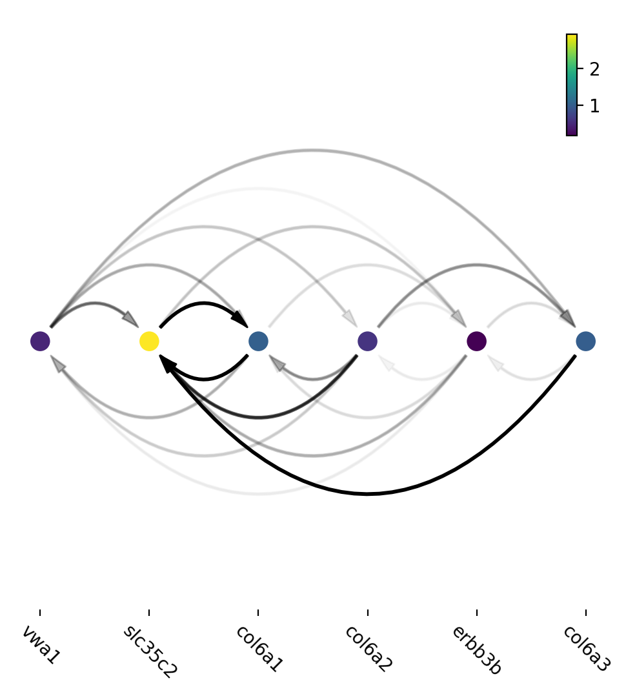

Similarly, network can also be built with other criteria and visualized
with other plots, like the circos plot or hive Plot. For example, we can
select 10 top genes with highest absolute acceleration values in
``Unknown`` cell type.

.. code:: ipython3

    selected_genes = adata.uns['rank_abs_acceleration']['Unknown'][:10]

.. code:: ipython3

    edges_list = dyn.vf.build_network_per_cluster(adata,
                                                  cluster='Cell_type',
                                                  cluster_names=None,
                                                  full_reg_rank=full_reg_rank,
                                                  full_eff_rank=full_eff_rank,
                                                  genes=selected_genes,
                                                  n_top_genes=1000)

.. parsed-literal::

    |-----> [iterating reg_groups] in progress: 100.0000%|-----> [iterating reg_groups] completed [1.4601s]

We can then focus on analyzing ``Unknown`` cell type network and
construct networkx graph structure for ``Unknown`` cell group. We next
constrain the edges by removing all edges with weight <= 0.0015.

.. code:: ipython3

    network = nx.from_pandas_edgelist(edges_list['Unknown'].drop_duplicates().query("weight > 0.0015"), 
                                      'regulator', 'target', 
                                      edge_attr='weight',
                                      create_using=nx.DiGraph())

Before drawing a circos plot, we can insert attributes into ``networkx``
``Graph`` object. In the code cell below, we assign average ``M_s``
values to each cluster to color the nodes in the circos plot later.

.. code:: ipython3

    color_key = "M_s"
    cluster_key = "Cell_type"
    selected_cluster = "Unknown"
    adata_layer_key = "M_s"
    for node in network.nodes:
        network.nodes[node]["M_s"] = adata[:, node].layers["M_s"].mean()
    
    for edge in network.edges:
        network.edges[edge]["weight"] *= 1000

Lastly, we can visulize the network with ``dyn.pl.circosPlot``.

.. code:: ipython3

    dyn.configuration.set_figure_params(background='white')
    dyn.pl.circosPlot(network, node_color_key="M_s", show_colorbar=True, edge_alpha_scale=0.7, edge_lw_scale=0.7)

.. parsed-literal::

    <Axes: >

Visualize gene expression, velocity, acceleration, curvature as a function of vector field based pseudotime.
^^^^^^^^^^^^^^^^^^^^^^^^^^^^^^^^^^^^^^^^^^^^^^^^^^^^^^^^^^^^^^^^^^^^^^^^^^^^^^^^^^^^^^^^^^^^^^^^^^^^^^^^^^^^

Here we can apply ``ddhodge`` to first obtain a measure of pseudotime
that is based on learned vector field function. Then we can visualize
gene expression, velocity, acceleration, curvature as a function of
vector field based pseudotime to reveal different aspects of gene
expression kinetics over time.

The kinetic heatmap shown below indicates that there are a few distinct
stages of gene expression changes (or velocity, acceleration, curvature,
etc.) during zebrafish pigmentation.

.. code:: ipython3

    dyn.ext.ddhodge(adata, basis='pca')

.. parsed-literal::

    |-----> graphizing vectorfield...
    |-----------? nbrs_idx argument is ignored and recomputed because nbrs_idx is not None and return_nbrs=True
    |-----------> calculating neighbor indices...
    |-----> [ddhodge completed] completed [32.4428s]

.. code:: ipython3

    transition_genes = adata.var_names[adata.var.use_for_transition]

Visualize the **gene expression dynamics** as a function of vector field
based pseudotime (*x-axis*).

.. code:: ipython3

    dyn.pl.kinetic_heatmap(adata, 
                           genes=transition_genes, 
                           tkey='pca_ddhodge_potential',
                           gene_order_method='maximum', 
                           mode='pseudotime', 
                           color_map='viridis',
                           yticklabels=False,    
                          )

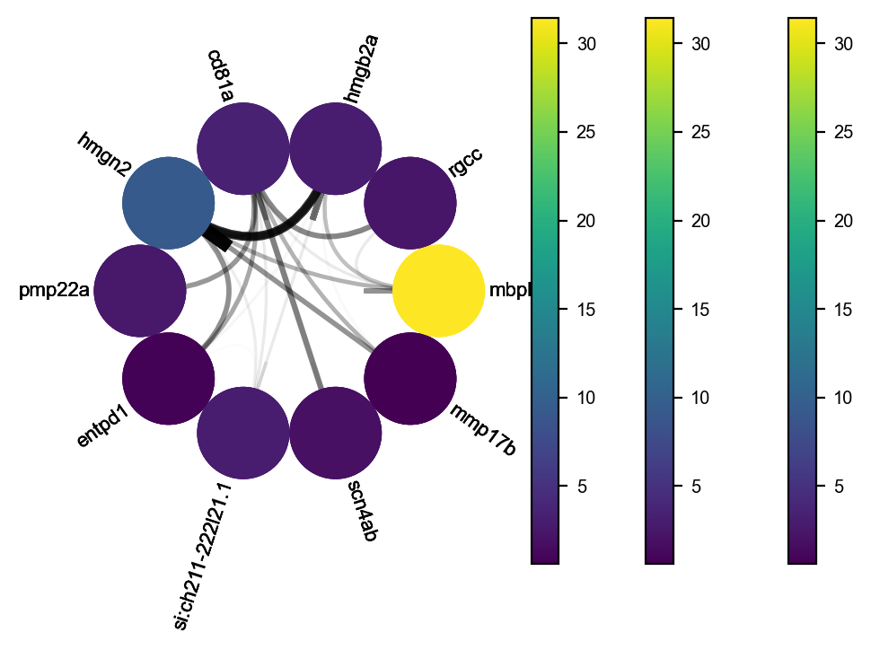

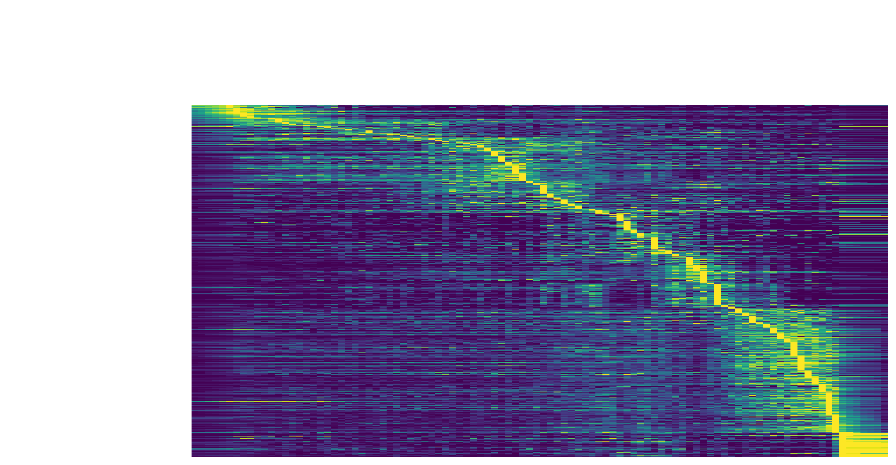

Note that if you want to visualize the gene expression for a specific
cell lineage, you can subset the adata via something like (the same
applies to other kinetic heatmaps):

Let us check the ``melanophore`` lineage by cross referencing the
vector-field based pseudotime and the streamline plots, overlaied with
cell-type annotations.

.. code:: ipython3

    dyn.pl.streamline_plot(adata, color=['pca_ddhodge_potential', 'Cell_type'])

.. parsed-literal::

    |-----------> plotting with basis key=X_umap
    |-----------> skip filtering Cell_type by stack threshold when stacking color because it is not a numeric type

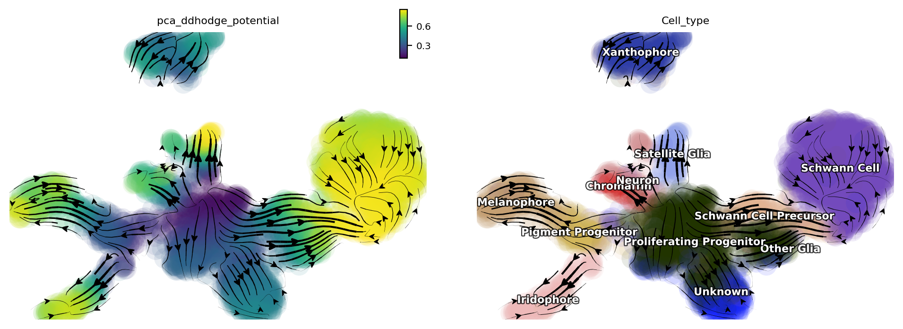

We can then collect cells from ``Proliferating Progenitor``,
``Pigment Progenitor``, ``Melanophore`` that forms the melanophore
lineage by subseting adata object. This adata subset is then used to
visualize the expression kinetic heatmap for the melanophore lineage.

.. code:: ipython3

    subset = adata[adata.obs.Cell_type.isin(['Proliferating Progenitor', 'Pigment Progenitor', 'Melanophore'])]
    
    dyn.pl.kinetic_heatmap(subset, 
                           genes=transition_genes, 
                           tkey='pca_ddhodge_potential',
                           gene_order_method='maximum', 
                           mode='pseudotime', 
                           color_map='viridis',
                           yticklabels=False,    
                          )

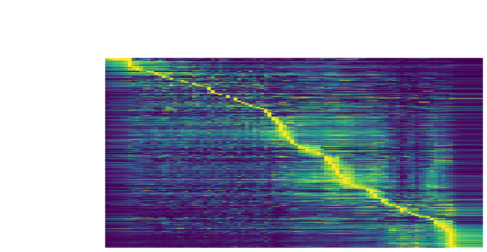

Visualize the **gene velocity dynamics** as a function of vector field
based pseudotime (*x-axis*).

.. code:: ipython3

    dyn.pl.kinetic_heatmap(adata, 
                           genes=transition_genes, 
                           tkey='pca_ddhodge_potential',
                           gene_order_method='maximum', 
                           layer='velocity_S',
                           mode='pseudotime', 
                           color_map='RdBu_r',
                           yticklabels=False,  
                          )

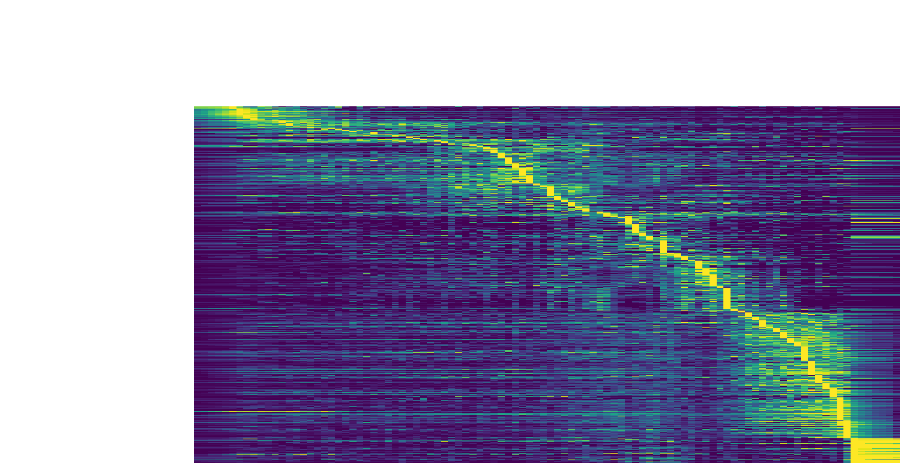

Visualize the **gene acceleration dynamics** as a function of vector
field based pseudotime (*x-axis*).

.. code:: ipython3

    dyn.pl.kinetic_heatmap(adata, 
                           genes=transition_genes, 
                           tkey='pca_ddhodge_potential',
                           gene_order_method='maximum', 
                           layer='acceleration',
                           mode='pseudotime', 
                           yticklabels=False,  
                           color_map='RdBu_r')

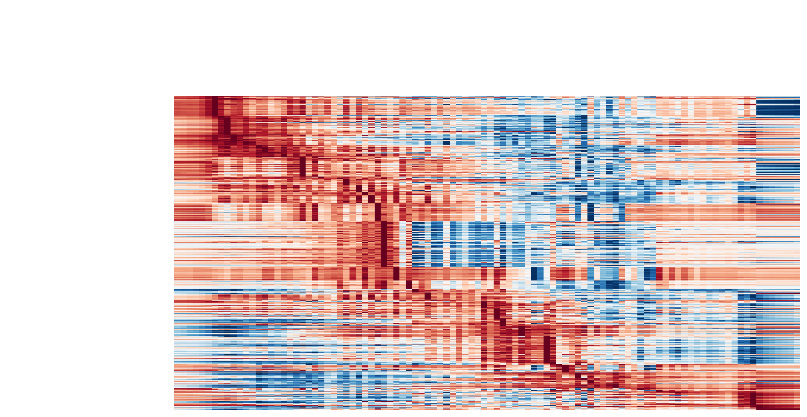

Visualize the **gene curvature dynamics** as a function of vector field
based pseudotime (*x-axis*).

.. code:: ipython3

    dyn.pl.kinetic_heatmap(adata, 
                           genes=transition_genes, 
                           tkey='pca_ddhodge_potential',
                           gene_order_method='maximum', 
                           layer='curvature',
                           mode='pseudotime', 
                           yticklabels=False,  
                           color_map='RdBu_r')

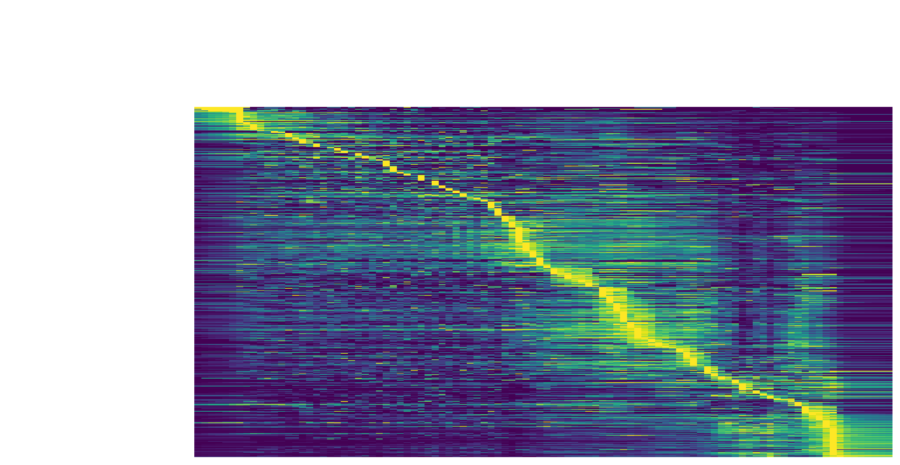

Build transition graph between cell states
^^^^^^^^^^^^^^^^^^^^^^^^^^^^^^^^^^^^^^^^^^

When projecting high-dimensional RNA velocity vectors into
low-dimensional space, **dynamo** builds a cell-wise transition matrix
by translating the velocity vector direction and the spatial
relationship of each cell to its neighbors to transition probabilities,
similar to velocyto, etc. **dynamo** uses a few different kernels to
build such a transition matrix which can then be used to run Markov
chain simulations, as we will demonstrate in future.

On the other hand, it is of great interests to obtain a transition graph
between cell types (states). **dynamo** implements such a functionality
with a few methods which effectively creates a model that summarizes the
possible cell type transitions based on the reconstructed Markov
transition matrix between cell or the vector field function.

To achieve this, we only need to build a state graph with
``dyn.pd.state_graph`` in a specific basis for a specific grouping. For
example, we can use the vector field integration based method ``vf`` to
build a transition graph between different cell types:

.. code:: ipython3

    %%capture
    dyn.pd.state_graph(adata, group='Cell_type', basis='pca', method='vf')

.. parsed-literal::

    |-----> Estimating the transition probability between cell types...
    |-----> Applying vector field
    |-----> [KDTree parameter preparation computation] in progress: 0.0000%|-----> [KDTree computation] completed [0.0037s]
    |-----> [iterate groups] in progress: 100.0000%|-----> [iterate groups] completed [42.6583s]
    |-----> [State graph estimation] completed [0.0007s]

Next, a state graph can be visualized with ``dyn.pl.state_graph``.

.. code:: ipython3

    dyn.pl.state_graph(adata, 
                       color=['Cell_type'], 
                       group='Cell_type', 
                       basis='umap', 
                       show_legend='on data',
                       method='vf');

.. parsed-literal::

    |-----------> plotting with basis key=X_umap
    |-----------> skip filtering Cell_type by stack threshold when stacking color because it is not a numeric type

.. parsed-literal::

    <Figure size 640x480 with 0 Axes>

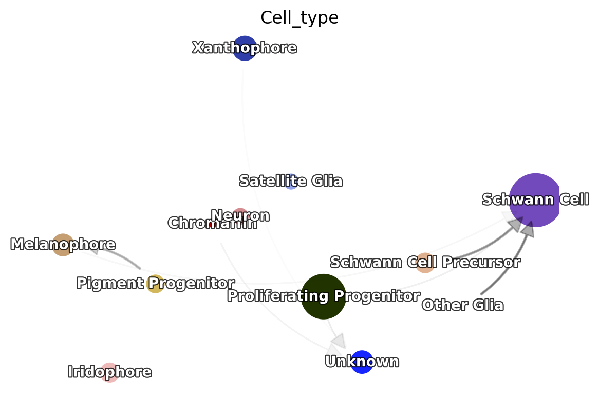

Save results
~~~~~~~~~~~~

save ranking information to an excel file
^^^^^^^^^^^^^^^^^^^^^^^^^^^^^^^^^^^^^^^^^

**dynamo** provides an utility function to automatically save the
ranking related data frames to an excel file with each ranking
information saved to a separate sheet in the xlsx file.

.. code:: ipython3

    dyn.export_rank_xlsx(adata, path="rank_info.xlsx")

.. parsed-literal::

    |-----> saving sheet: rank_velocity_S
    |-----> saving sheet: rank_abs_velocity_S
    |-----> saving sheet: rank_acceleration
    |-----> saving sheet: rank_abs_acceleration
    |-----> saving sheet: rank_curvature
    |-----> saving sheet: rank_abs_curvature
    |-----> saving sheet: rank_div_gene_jacobian_pca

Save data with pickle dumping or pandas dataframe to_csv
^^^^^^^^^^^^^^^^^^^^^^^^^^^^^^^^^^^^^^^^^^^^^^^^^^^^^^^^

In addition, you can directly either export data to a csv file via:

.. code:: python

   adata.uns['rank_acceleration'].to_csv('./zebrafish_vf_rank_acceleration.csv')

Alternatively, you can save the data via pickle dump:

.. code:: python

   import pickle

   pickle.dump(adata.uns['rank_acceleration'], open('./zebrafish_vf_rank_acceleration.p', 'wb'))
   pickle.dump(full_reg_rank, open('./zebrafish_vf_full_reg_rank.p', 'wb'))

   _acceleration_rank = pickle.load(open('./zebrafish_vf_rank_acceleration.p', 'rb'))
   _acceleration_rank.head(2)

Dynamo save utility
^^^^^^^^^^^^^^^^^^^

Note that there may be intermediate results stored in adata.uns that can
may lead to errors when writing the ``h5ad`` object. For now, we suggest
users to call ``dyn.cleanup(adata)`` first to remove these data objects
before saving the adata object.

.. code:: ipython3

    dyn.cleanup(adata);

call ``AnnData`` ``write_h5ad`` to save the entire adata information.

.. code:: ipython3

    adata.write_h5ad("./tutorial_processed_zebrafish_data.h5ad")

You can load in the data later if need:

.. code:: python

   _adata = dyn.read_h5ad(("./tutorial_processed_zebrafish_data.h5ad"))
