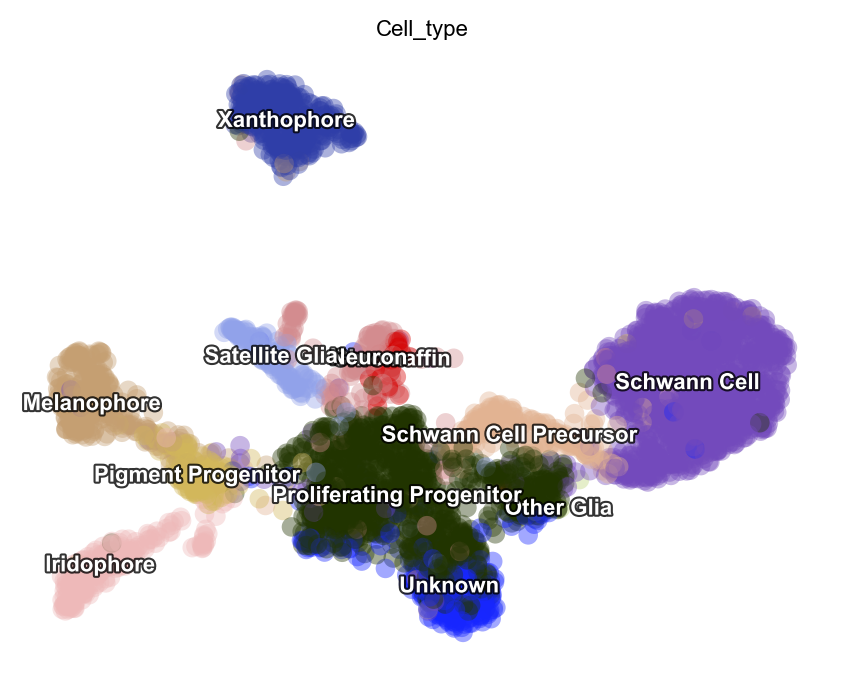
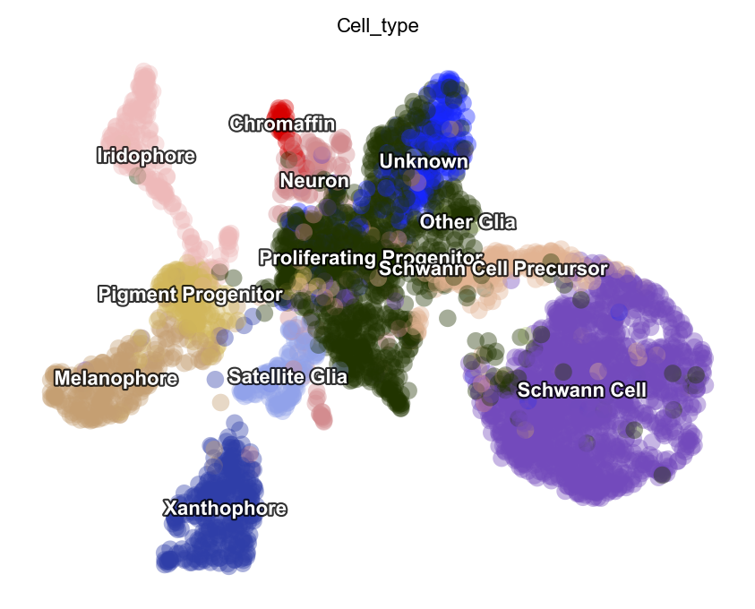
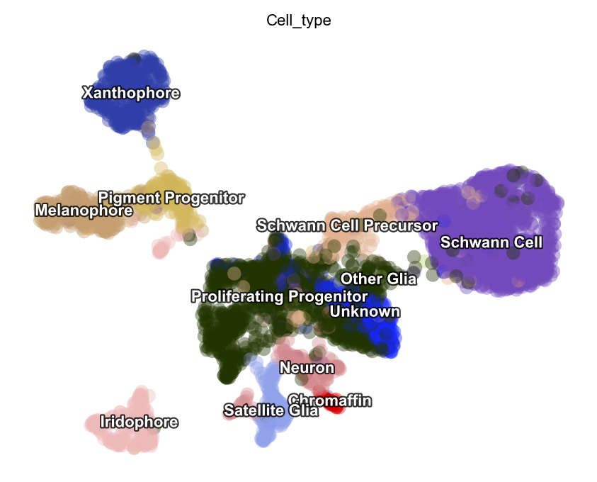
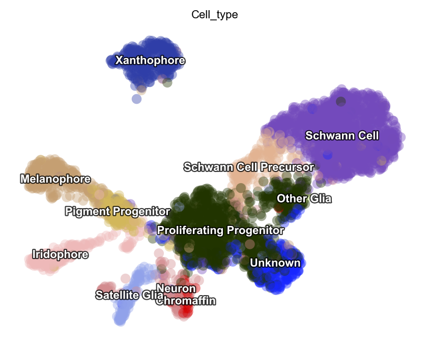
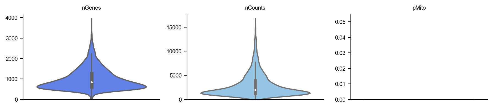
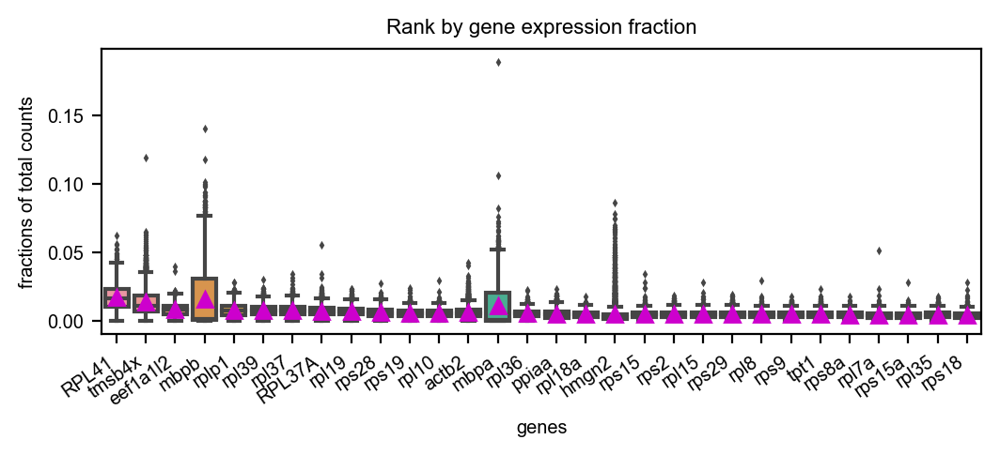
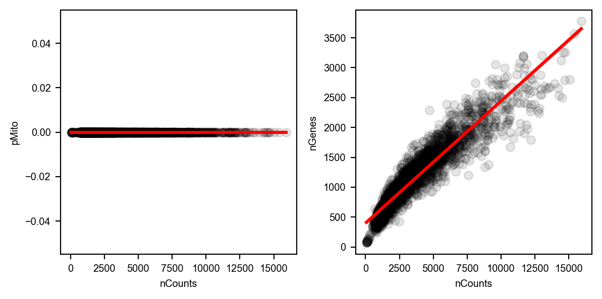
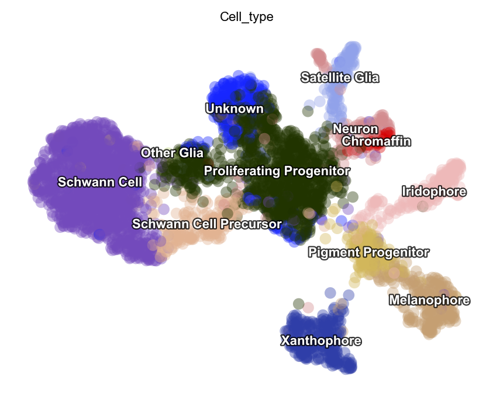
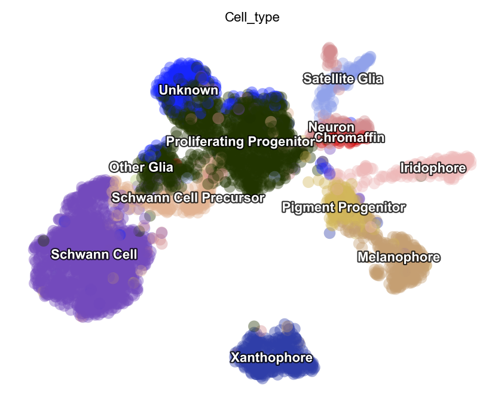
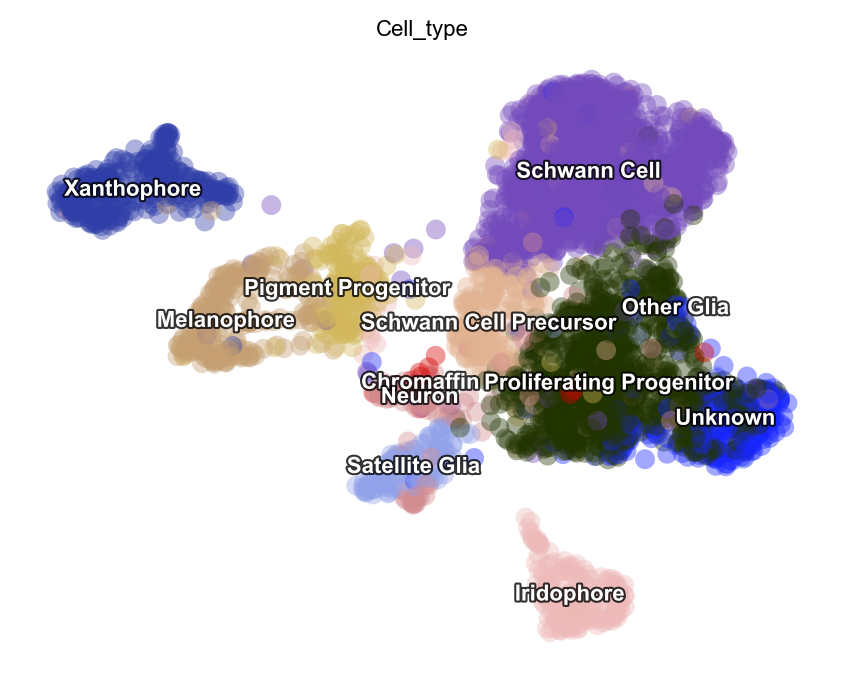

.. raw:: html

    

      
      
    

Preprocessing Tutorial
======================

This tutorial is designed to show you how Dynamo preprocess the regular
scRNA-seq or time-resolved metabolic labeling enabled scRNA-seq data. In
this new release of ``dynamo 1.3.0``, we introduce the ``Preprocessor``
class (many parts of it has been implemented previously and but
extensively updated and refined in this release), which allows you to
convenietntly explore different preprocessing recipes with configurable
parameters inside the class. The ``Preprocessor`` currently includes
several existing recipes such as ``monocle``, ``pearson residual``,
``seurat``, and ``sctransform``. Furthermore, you can easily replace
each preprocessing step with your own method of preprocessing. For
example, the Preprocessor’s monocle pipeline contains steps such as
``filter_cells_by_outliers``, ``filter_genes_by_outliers``,
``normalize_by_cells``, and ``select_genes``. You can replace the
default preprocessing steps with your own method and modify default
monocle parameters passed into these functions by reconfiguring the
attributes of the Preprocessor class.

.. image:: Preprocessor_tutorial_files/preprocessing_structure_final.pdf
    :target: https://github.com/Sichao25/dynamo-tutorials/blob/debug_notebooks/images/preprocessing_structure_final.pdf

The recipes in dynamo
---------------------

To make your life easy, currently dynamo supports 4 major receipe for
preprocessing. Please find at the end of this tutorial how you can
customize your preprocessing method.

-  ``Monocle``: Monocle recipe uses similar but generalized strategy
   from `Monocle 3 <https://cole-trapnell-lab.github.io/monocle3/>`__ to
   normalize all datasets in different layers (the spliced and unspliced
   or new, i.e. metabolic labelled, and total mRNAs or others), followed
   by feature selection, log1p transformation of the data and principal
   component analysis (PCA) dimension reduction. For more details,
   please refer to the
   `paper <https://cole-trapnell-lab.github.io/monocle3/papers/>`__ and
   `code <https://github.com/Ukyeon/dynamo-release/blob/e7dd31408dabe5ce44e79a489badb106626a7109/dynamo/preprocessing/Preprocessor.py#L500>`__.
-  ``Pearson Residuals``: Pearson Residuals recipe implements a
   preprocessing pipeline proposed in the study by Lause, Berens, and
   Kobak (2021) that uses Pearson Residuals for the normalization of
   single-cell RNA-seq UMI data. This method performs several steps
   including standardization, filtering of cells and genes by outliers,
   select_genes_by_pearson_residuals, appending or excluding gene lists,
   normalize_layers_pearson_residuals, regression, and PCA. This
   pipeline aims to preprocess the data using the Pearson residuals
   method to prepare it for downstream analysis. For more details,
   please refer to the
   `paper <https://genomebiology.biomedcentral.com/articles/10.1186/s13059-021-02451-7>`__
   and
   `code <https://github.com/Ukyeon/dynamo-release/blob/e7dd31408dabe5ce44e79a489badb106626a7109/dynamo/preprocessing/Preprocessor.py#L681>`__.
-  ``Seurat``: Seurat recipe implements a preprocessing pipeline based
   on the Seurat package’s approach to single-cell data integration and
   analysis. This recipe performs various steps including
   standardization, filtering of cells and genes by outliers,
   calculation of size factors, normalization by cells, gene selection,
   appending or excluding gene lists, normalization method selection,
   regression, and PCA. This pipeline follows the Seurat methodology for
   preprocessing single-cell data, as described in the
   `publications <https://www.biorxiv.org/content/10.1101/460147v1>`__
   by Stuart and Butler et al. (Cell, 2019) and Butler et al. (Nat
   Biotechnol). The goal is to prepare the data for downstream analysis
   and integration using Seurat’s methods. For more details, please
   refer to the
   `code <https://github.com/Ukyeon/dynamo-release/blob/e7dd31408dabe5ce44e79a489badb106626a7109/dynamo/preprocessing/Preprocessor.py#L558>`__
   and `documentation <https://satijalab.org/seurat/>`__.
-  ``Sctransform``: Sctransform recipe implements a preprocessing
   pipeline based on the sctransform method developed by Hao and Hao et
   al. This performs several steps including standardization, filtering
   of cells and genes by outliers, gene selection, appending or
   excluding gene lists, performing the sctransform method, regression,
   and PCA. The sctransform method is a model of single cell UMI
   expression data using regularized negative binomial regression and an
   integrated analysis approach for multimodal single-cell data. This
   pipeline aims to preprocess the data using the sctransform method to
   account for downstream analysis. For more details, please refer to
   the
   `paper <https://www.sciencedirect.com/science/article/pii/S0092867421005833>`__,
   `code <https://github.com/Ukyeon/dynamo-release/blob/e7dd31408dabe5ce44e79a489badb106626a7109/dynamo/preprocessing/Preprocessor.py#L619>`__,
   and `R code <https://github.com/satijalab/sctransform>`__.

Note: In older versions, dynamo offered several recipes, among which
``recipe_monocle`` is a basic function as a building block of other
recipes. You can still use these functions to preprocess data.

Preprocessor provides users with ``config_monocle_recipe`` and other
``config_*_recipes`` methods to help you reproduce different
preprocessor results and integrate with your newly developed
preprocessing algorithms.

Without further ado, let’s begin by importing packages.

.. code:: ipython3

    import warnings
    warnings.filterwarnings('ignore')
    warnings.filterwarnings("ignore", message="numpy.dtype size changed") 

.. code:: ipython3

    import dynamo as dyn
    import seaborn as sns
    import matplotlib.pyplot as plt
    import matplotlib
    import numpy as np

If you would like to enable debug log messages to check the
preprocessing procedure, simply uncomment the code snippet below

.. code:: ipython3

    # dyn.dynamo_logger.main_set_level("DEBUG")

Glossary of keys generated during preprocessing
-----------------------------------------------

you do need to update all list to series…
^^^^^^^^^^^^^^^^^^^^^^^^^^^^^^^^^^^^^^^^^

-  ``adata.obs.pass_basic_filter``: a *series* of boolean variables
   indicating whether cells pass certain basic filters. In monocle
   recipe, the basic filtering is based on thresholding of expression
   values.
-  ``adata.var.pass_basic_filter``: a *series* of boolean variables
   indicating whether genes pass certain basic filters. In monocle
   recipe, the basic filtering is based on thresholding of expression
   values.
-  ``adata.var.use_for_pca``: a *series* of boolean variables points to
   feature genes selected for PCA dimension reduction and following
   downstream RNA velocity and vector field analysis. In many recipes,
   this key is equivalent to highly variable genes.
-  ``adata.var.highly_variable_scores``: a *series* of float number
   scores indicating how variable each gene is, typically generated
   during gene feature selection (``preprocessor.select_genes``). Note
   only part of recipes do not have this highly variable scores. E.g.
   ``seuratV3`` recipe implemented in dynamo does not have highly
   variable scores due to its thresholding nature.
-  ``adata.layers['X_spliced']``: spliced expression matrix after
   normalization used in downstream computation.
-  ``data.layers['X_unspliced']``: unspliced expression matrix after
   normalization used in downstream computation.
-  ``adata.obsm['X_pca']``: normalized X after PCA transformation.
-  ``adata.X``: normalized X (e.g. size factor normalized and log1p
   transformed)

Using predefined (default) recipe configurations in preprocessor
----------------------------------------------------------------

Firstly, you can just start with the inclusion of a preprocessor, so
that your life can become much easier. With just three lines of code,
the preprocessor can handle the entire process of data filtering,
manipulation, calculation, and conversion. You no longer have to worry
about the headaches associated with these tasks.

.. code:: ipython3

    from dynamo.preprocessing import Preprocessor

Applying Monocle Recipe
~~~~~~~~~~~~~~~~~~~~~~~

.. code:: ipython3

    # download the data 
    adata = dyn.sample_data.zebrafish()
    celltype_key = "Cell_type"

.. parsed-literal::

    |-----> Downloading data to ./data/zebrafish.h5ad

.. code:: ipython3

    adata

.. parsed-literal::

    AnnData object with n_obs × n_vars = 4181 × 16940
        obs: 'split_id', 'sample', 'Size_Factor', 'condition', 'Cluster', 'Cell_type', 'umap_1', 'umap_2', 'batch'
        layers: 'spliced', 'unspliced'

.. code:: ipython3

    preprocessor = Preprocessor()
    preprocessor.preprocess_adata(adata, recipe="monocle")
    
    # Alternative
    # preprocessor.config_monocle_recipe(adata)
    # preprocessor.preprocess_adata_monocle(adata)

.. parsed-literal::

    |-----> Running monocle preprocessing pipeline...
    |-----------> filtered out 14 outlier cells
    |-----------> filtered out 12746 outlier genes
    |-----> PCA dimension reduction
    |-----> <insert> X_pca to obsm in AnnData Object.
    |-----> [Preprocessor-monocle] completed [3.5468s]

.. code:: ipython3

    adata

.. parsed-literal::

    AnnData object with n_obs × n_vars = 4167 × 16940
        obs: 'split_id', 'sample', 'Size_Factor', 'condition', 'Cluster', 'Cell_type', 'umap_1', 'umap_2', 'batch', 'nGenes', 'nCounts', 'pMito', 'pass_basic_filter', 'initial_cell_size', 'unspliced_Size_Factor', 'initial_unspliced_cell_size', 'spliced_Size_Factor', 'initial_spliced_cell_size', 'ntr'
        var: 'nCells', 'nCounts', 'pass_basic_filter', 'log_cv', 'score', 'log_m', 'frac', 'use_for_pca', 'ntr'
        uns: 'pp', 'velocyto_SVR', 'feature_selection', 'PCs', 'explained_variance_ratio_', 'pca_mean'
        obsm: 'X_pca'
        layers: 'spliced', 'unspliced', 'X_spliced', 'X_unspliced'

.. code:: ipython3

    dyn.tl.reduceDimension(adata, basis="pca")
    # pointsize can be used to set the size of data points (cells) while alpha set the transparency value of the data points 
    dyn.pl.umap(adata, color=celltype_key, pointsize=0.2, alpha=0.4) 

.. parsed-literal::

    |-----> retrieve data for non-linear dimension reduction...
    |-----> [UMAP] using X_pca with n_pca_components = 30
    |-----> <insert> X_umap to obsm in AnnData Object.
    |-----> [UMAP] completed [27.4297s]
    |-----------> plotting with basis key=X_umap
    |-----------> skip filtering Cell_type by stack threshold when stacking color because it is not a numeric type

Applying Pearson Residuals Recipe
~~~~~~~~~~~~~~~~~~~~~~~~~~~~~~~~~

Please note that pearson residual or sctransform transformation should
only be performed for adata.X and not applied to different layers. This
is because RNA velocity do have physical meanings, and otherwise
spliced/unspliced data will reseult in negative values after
transformation.

.. code:: ipython3

    adata = dyn.sample_data.zebrafish()
    preprocessor = Preprocessor()
    
    preprocessor.preprocess_adata(adata, recipe="pearson_residuals")
    
    # Alternative
    # preprocessor.config_pearson_residuals_recipe(adata)
    # preprocessor.preprocess_adata_pearson_residuals(adata)

.. parsed-literal::

    |-----> Downloading data to ./data/zebrafish.h5ad
    |-----> gene selection on layer: X
    |-----> extracting highly variable genes
    |-----------> filtered out 350 outlier genes
    |-----> applying Pearson residuals to layer <X>
    |-----> replacing layer <X> with pearson residual normalized data.
    |-----> [pearson residual normalization for X] completed [1.1042s]
    |-----> PCA dimension reduction
    |-----> <insert> X_pca to obsm in AnnData Object.
    |-----> [Preprocessor-pearson residual] completed [4.8708s]

.. code:: ipython3

    dyn.tl.reduceDimension(adata)
    dyn.pl.umap(adata, color=celltype_key, pointsize=0.2, alpha=0.4)

.. parsed-literal::

    |-----> retrieve data for non-linear dimension reduction...
    |-----> [UMAP] using X_pca with n_pca_components = 30
    |-----> <insert> X_umap to obsm in AnnData Object.
    |-----> [UMAP] completed [16.7289s]
    |-----------> plotting with basis key=X_umap
    |-----------> skip filtering Cell_type by stack threshold when stacking color because it is not a numeric type

Applying Sctransform Recipe
~~~~~~~~~~~~~~~~~~~~~~~~~~~

Sctransform transformation is only applied to adata.X and not applied to
different layers, as stated above.

.. code:: ipython3

    import warnings
    warnings.filterwarnings('ignore', category=UserWarning, message='Сould not load pytorch')
    warnings.filterwarnings("ignore", category=DeprecationWarning) 
    
    adata = dyn.sample_data.zebrafish()
    preprocessor = Preprocessor()
    
    preprocessor.preprocess_adata(adata, recipe="sctransform")
    
    # Alternative
    # preprocessor.config_sctransform_recipe(adata)
    # preprocessor.preprocess_adata_sctransform(adata)

.. parsed-literal::

    |-----> Downloading data to ./data/zebrafish.h5ad
    |-----> Running Sctransform recipe preprocessing...
    |-----------> filtered out 14 outlier cells
    |-----------> filtered out 12410 outlier genes
    |-----? Sctransform recipe will subset the data first with default gene selection function for efficiency. If you want to disable this, please perform sctransform without recipe.
    |-----> sctransform adata on layer: X
    |-----------> set sctransform results to adata.X
    |-----> PCA dimension reduction
    |-----> <insert> X_pca to obsm in AnnData Object.
    |-----> [Preprocessor-sctransform] completed [16.6057s]

.. code:: ipython3

    dyn.tl.reduceDimension(adata)
    dyn.pl.umap(adata, color=celltype_key, pointsize=0.2, alpha=0.4)

.. parsed-literal::

    |-----> retrieve data for non-linear dimension reduction...
    |-----> [UMAP] using X_pca with n_pca_components = 30
    |-----> <insert> X_umap to obsm in AnnData Object.
    |-----> [UMAP] completed [16.2677s]
    |-----------> plotting with basis key=X_umap
    |-----------> skip filtering Cell_type by stack threshold when stacking color because it is not a numeric type

Applying Seurat Recipe
~~~~~~~~~~~~~~~~~~~~~~

.. code:: ipython3

    adata = dyn.sample_data.zebrafish()
    preprocessor = Preprocessor()
    
    # Alternative
    # preprocessor.config_seurat_recipe(adata)
    # preprocessor.preprocess_adata_seurat(adata)
    
    preprocessor.preprocess_adata(adata, recipe="seurat")

.. parsed-literal::

    |-----> Downloading data to ./data/zebrafish.h5ad
    |-----> Running Seurat recipe preprocessing...
    |-----------> filtered out 14 outlier cells
    |-----------> filtered out 11388 outlier genes
    |-----> select genes on var key: pass_basic_filter
    |-----------> choose 2000 top genes
    |-----> number of selected highly variable genes: 2000
    |-----> PCA dimension reduction
    |-----> <insert> X_pca to obsm in AnnData Object.
    |-----> [Preprocessor-seurat] completed [1.4041s]

.. code:: ipython3

    dyn.tl.reduceDimension(adata)
    dyn.pl.umap(adata, color=celltype_key, pointsize=0.2, alpha=0.4)

.. parsed-literal::

    |-----> retrieve data for non-linear dimension reduction...
    |-----> [UMAP] using X_pca with n_pca_components = 30
    |-----> <insert> X_umap to obsm in AnnData Object.
    |-----> [UMAP] completed [16.0549s]
    |-----------> plotting with basis key=X_umap
    |-----------> skip filtering Cell_type by stack threshold when stacking color because it is not a numeric type

Customize function parameters configured in Preprocessor
--------------------------------------------------------

In this example, we will use the monocle recipe to demonstrate how we
can configure Preprocessor cluster to select genes based on your needs.
Note that we can set the recipe to be ``dynamo_monocle``, ``seurat``, or
others to apply different criteria for selecting genes. We can also set
the ``select_genes_kwargs`` parameter in the preprocessor to pass
additional desired parameters. By default, the recipe is set to
``dynamo_monocle``. We can change it to ``seurat`` and add other
constraint parameters if needed.

.. code:: ipython3

    adata = dyn.sample_data.zebrafish()
    preprocessor = Preprocessor()
    preprocessor.config_monocle_recipe(adata)

.. parsed-literal::

    |-----> Downloading data to ./data/zebrafish.h5ad

``preprocessor.select_genes_kwargs`` contains arguments that will be
passed to ``select_genes`` step.

.. code:: ipython3

    preprocessor.select_genes_kwargs

.. parsed-literal::

    {'n_top_genes': 2000, 'SVRs_kwargs': {'relative_expr': False}}

To set the preprocessing steps and their corresponding function
parameters for the monocle recipe, we can call
``preprocessor.config_monocle_recipe()``. By default, the constructor
parameters of the Preprocessor for preprocessing are set to the monocle
recipe used in report the Dynamo cell paper
`dynamo <https://www.cell.com/cell/pdf/S0092-8674(21)01577-4.pdf>`__.

If you would like to customize the dataset to better fit your
preferences, you can adjust the parameters before running the recipe.
Here is an example.

To begin, you can create a plot of the basic statistics (nGenes,
nCounts, and pMito) for each category of adata. - nGenes: the number of
genes - nCounts: the number of cells - pMito: the percentage of
mitochondria genes.

.. code:: ipython3

    dyn.pl.basic_stats(adata, figsize=(3, 2))

You can visualize the rank of the fraction of UMI to the total UMI per
cell for the top 20 genes

.. code:: ipython3

    dyn.pl.highest_frac_genes(adata, figsize=(6, 2))

.. parsed-literal::

    |-----------? use_for_pca not in adata.var, ignoring the gene annotation key when plotting

.. parsed-literal::

    <AxesSubplot:title={'center':'Rank by gene expression fraction'}, xlabel='genes', ylabel='fractions of total counts'>

You can get rid of any cells that have mitochondrial gene expression
percentage greater than pMito or total counts greater than nCounts. You
can adjust the threshold values as per your requirements.

Note that in our particular case, our data doesn’t have mitochondria
counts.

.. code:: ipython3

    import seaborn as sns
    import matplotlib.pyplot as plt
    
    # Create the first figure
    df = adata.obs.loc[:, ["nCounts", "pMito", "nGenes"]]
    fig, (ax1, ax2) = plt.subplots(1, 2, figsize=(6, 3))  # Adjust the figsize as desired
    
    sns.regplot(data=df, 
                x="nCounts", 
                y="pMito", 
                ax=ax1,
                scatter_kws={"color": "black",  "alpha": 0.1}, 
                line_kws={"color": "red"})
    ax1.set_xlabel("nCounts")
    ax1.set_ylabel("pMito")
    
    # Create the second figure
    sns.regplot(data=df, 
                x="nCounts", 
                y="nGenes", 
                ax=ax2, 
                scatter_kws={"color": "black",  "alpha": 0.1}, 
                line_kws={"color": "red"})
    ax2.set_xlabel("nCounts")
    ax2.set_ylabel("nGenes")
    
    # Display the figures side by side
    plt.tight_layout()  # Optional: Adjusts spacing between subplots
    plt.show()

And modify some values of parameters based on the information above.

.. code:: ipython3

    preprocessor.filter_cells_by_outliers_kwargs = {
        "filter_bool": None,
        "layer": "all",
        "min_expr_genes_s": 300,
        "min_expr_genes_u": 100,
        "min_expr_genes_p": 50,
        "max_expr_genes_s": np.inf,
        "max_expr_genes_u": np.inf,
        "max_expr_genes_p": np.inf,
        "shared_count": None,
    }

.. code:: ipython3

    preprocessor.filter_genes_by_outliers_kwargs = {
        "filter_bool": None,
        "layer": "all",
        "min_cell_s": 3,
        "min_cell_u": 2,
        "min_cell_p": 1,
        "min_avg_exp_s": 0,
        "min_avg_exp_u": 0,
        "min_avg_exp_p": 0,
        "max_avg_exp": np.inf,
        "min_count_s": 5,
        "min_count_u": 0,
        "min_count_p": 0,
        "shared_count": 40,
    }

.. code:: ipython3

    preprocessor.select_genes_kwargs = {
        "n_top_genes": 2500,
        "sort_by": "cv_dispersion",
        "keep_filtered": True,
        "SVRs_kwargs": {
            "relative_expr": True,
            "total_szfactor": "total_Size_Factor",
            "min_expr_cells": 0,
            "min_expr_avg": 0,
            "max_expr_avg": np.inf,
            "winsorize": False,
            "winsor_perc": (1, 99.5),
            "sort_inverse": False,
            "svr_gamma": None,
        },
    }

Let`s run the monocle recipe again.

.. code:: ipython3

    preprocessor.preprocess_adata_monocle(adata)

.. parsed-literal::

    |-----> Running monocle preprocessing pipeline...
    |-----------> filtered out 125 outlier cells
    |-----------> filtered out 13035 outlier genes
    |-----> PCA dimension reduction
    |-----> <insert> X_pca to obsm in AnnData Object.
    |-----> [Preprocessor-monocle] completed [2.9955s]

.. code:: ipython3

    dyn.tl.reduceDimension(adata, basis="pca")
    dyn.pl.umap(adata, color=celltype_key, pointsize=0.2, alpha=0.4)

.. parsed-literal::

    |-----> retrieve data for non-linear dimension reduction...
    |-----> [UMAP] using X_pca with n_pca_components = 30
    |-----> <insert> X_umap to obsm in AnnData Object.
    |-----> [UMAP] completed [25.0124s]
    |-----------> plotting with basis key=X_umap
    |-----------> skip filtering Cell_type by stack threshold when stacking color because it is not a numeric type

Let`s run the seurat recipe in this time.

.. code:: ipython3

    adata = dyn.sample_data.zebrafish()
    preprocessor = Preprocessor()
    preprocessor.config_seurat_recipe(adata)

.. parsed-literal::

    |-----> Downloading data to ./data/zebrafish.h5ad

.. code:: ipython3

    preprocessor.select_genes_kwargs

.. parsed-literal::

    {'algorithm': 'seurat_dispersion', 'n_top_genes': 2000}

.. code:: ipython3

    preprocessor.select_genes_kwargs = dict(
        n_top_genes=2500,
        algorithm="seurat_dispersion", # or "fano_dispersion"
        seurat_min_disp=None,
        seurat_max_disp=None,
        seurat_min_mean=0.4,
        seurat_max_mean=0.6,
    )
    preprocessor.select_genes_kwargs

.. parsed-literal::

    {'n_top_genes': 2500,
     'algorithm': 'seurat_dispersion',
     'seurat_min_disp': None,
     'seurat_max_disp': None,
     'seurat_min_mean': 0.4,
     'seurat_max_mean': 0.6}

.. code:: ipython3

    preprocessor.preprocess_adata_seurat(adata)
    dyn.tl.reduceDimension(adata, basis="pca")
    dyn.pl.umap(adata, color=celltype_key, pointsize=0.2, alpha=0.4)

.. parsed-literal::

    |-----> Running Seurat recipe preprocessing...
    |-----------> filtered out 14 outlier cells
    |-----------> filtered out 11388 outlier genes
    |-----> select genes on var key: pass_basic_filter
    |-----------> choose 2500 top genes
    |-----> number of selected highly variable genes: 2500
    |-----> PCA dimension reduction
    |-----> <insert> X_pca to obsm in AnnData Object.
    |-----> [Preprocessor-seurat] completed [1.4892s]
    |-----> retrieve data for non-linear dimension reduction...
    |-----> [UMAP] using X_pca with n_pca_components = 30
    |-----> <insert> X_umap to obsm in AnnData Object.
    |-----> [UMAP] completed [15.9357s]
    |-----------> plotting with basis key=X_umap
    |-----------> skip filtering Cell_type by stack threshold when stacking color because it is not a numeric type

Customize and run each functions directly.
------------------------------------------

We understand that some of you may prefer to use the each function by
calling your own customized parameters. To cater to these needs, we have
prepared the following guidances help you utilizing the conventional
steps with our new preprocessor class. This way, you can still take
advantage of the benefits of the preprocessor while also incorporating
your own specific requirements.

.. code:: ipython3

    pp = Preprocessor()
    adata = dyn.sample_data.zebrafish()
    pp.standardize_adata(adata, 'time', None)

.. parsed-literal::

    |-----> Downloading data to ./data/zebrafish.h5ad

.. code:: ipython3

    adata

.. parsed-literal::

    AnnData object with n_obs × n_vars = 4181 × 16940
        obs: 'split_id', 'sample', 'Size_Factor', 'condition', 'Cluster', 'Cell_type', 'umap_1', 'umap_2', 'batch', 'nGenes', 'nCounts', 'pMito'
        var: 'nCells', 'nCounts'
        uns: 'pp'
        layers: 'spliced', 'unspliced'

.. code:: ipython3

    pp.filter_cells_by_outliers(adata, max_expr_genes_s=2000)

.. parsed-literal::

    |-----------> filtered out 244 outlier cells

.. parsed-literal::

    AnnData object with n_obs × n_vars = 3937 × 16940
        obs: 'split_id', 'sample', 'Size_Factor', 'condition', 'Cluster', 'Cell_type', 'umap_1', 'umap_2', 'batch', 'nGenes', 'nCounts', 'pMito', 'pass_basic_filter'
        var: 'nCells', 'nCounts'
        uns: 'pp'
        layers: 'spliced', 'unspliced'

.. code:: ipython3

    pp.filter_genes_by_outliers(adata, max_avg_exp=2000, shared_count=40)

.. parsed-literal::

    |-----------> filtered out 13890 outlier genes

.. parsed-literal::

    tmsb4x         True
    rpl8           True
    ppiaa          True
    rpl10a         True
    rps4x          True
                  ...  
    cdc42ep1a     False
    camk1da       False
    zdhhc22       False
    zgc:153681    False
    mmp16b        False
    Name: pass_basic_filter, Length: 16940, dtype: bool

.. code:: ipython3

    adata.var['pass_basic_filter'].sum()

.. parsed-literal::

    3050

.. code:: ipython3

    pp.normalize_by_cells(adata)

.. parsed-literal::

    AnnData object with n_obs × n_vars = 3937 × 16940
        obs: 'split_id', 'sample', 'Size_Factor', 'condition', 'Cluster', 'Cell_type', 'umap_1', 'umap_2', 'batch', 'nGenes', 'nCounts', 'pMito', 'pass_basic_filter', 'spliced_Size_Factor', 'initial_spliced_cell_size', 'unspliced_Size_Factor', 'initial_unspliced_cell_size', 'initial_cell_size'
        var: 'nCells', 'nCounts', 'pass_basic_filter'
        uns: 'pp'
        layers: 'spliced', 'unspliced', 'X_spliced', 'X_unspliced'

.. code:: ipython3

    pp.select_genes(adata, sort_by="fano_dispersion") # "cv_dispersion" or "gini"

.. code:: ipython3

    pp.norm_method(adata) # log1p

.. parsed-literal::

    AnnData object with n_obs × n_vars = 3937 × 16940
        obs: 'split_id', 'sample', 'Size_Factor', 'condition', 'Cluster', 'Cell_type', 'umap_1', 'umap_2', 'batch', 'nGenes', 'nCounts', 'pMito', 'pass_basic_filter', 'spliced_Size_Factor', 'initial_spliced_cell_size', 'unspliced_Size_Factor', 'initial_unspliced_cell_size', 'initial_cell_size'
        var: 'nCells', 'nCounts', 'pass_basic_filter', 'log_cv', 'score', 'log_m', 'frac', 'use_for_pca'
        uns: 'pp', 'velocyto_SVR', 'feature_selection'
        layers: 'spliced', 'unspliced', 'X_spliced', 'X_unspliced'

.. code:: ipython3

    pp.regress_out(adata, obs_keys=['nCounts', 'pMito'])

.. parsed-literal::

    |-----> [regress out] completed [28.5796s]

.. code:: ipython3

    pp.pca(adata)

.. parsed-literal::

    |-----> <insert> X_pca to obsm in AnnData Object.

.. parsed-literal::

    AnnData object with n_obs × n_vars = 3937 × 16940
        obs: 'split_id', 'sample', 'Size_Factor', 'condition', 'Cluster', 'Cell_type', 'umap_1', 'umap_2', 'batch', 'nGenes', 'nCounts', 'pMito', 'pass_basic_filter', 'spliced_Size_Factor', 'initial_spliced_cell_size', 'unspliced_Size_Factor', 'initial_unspliced_cell_size', 'initial_cell_size'
        var: 'nCells', 'nCounts', 'pass_basic_filter', 'log_cv', 'score', 'log_m', 'frac', 'use_for_pca'
        uns: 'pp', 'velocyto_SVR', 'feature_selection', 'PCs', 'explained_variance_ratio_', 'pca_mean'
        obsm: 'X_pca'
        layers: 'spliced', 'unspliced', 'X_spliced', 'X_unspliced'

.. code:: ipython3

    dyn.tl.reduceDimension(adata, basis="pca")
    dyn.pl.umap(adata, color="Cell_type", pointsize=0.2, alpha=0.4)

.. parsed-literal::

    |-----> retrieve data for non-linear dimension reduction...
    |-----> [UMAP] using X_pca with n_pca_components = 30
    |-----> <insert> X_umap to obsm in AnnData Object.
    |-----> [UMAP] completed [21.4056s]
    |-----------> plotting with basis key=X_umap
    |-----------> skip filtering Cell_type by stack threshold when stacking color because it is not a numeric type

