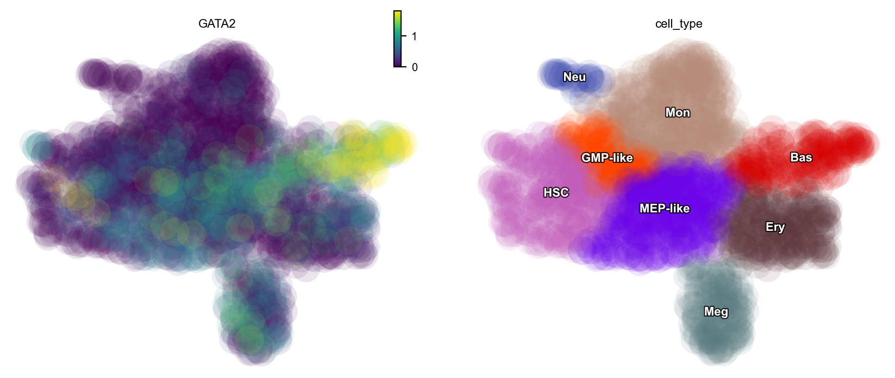
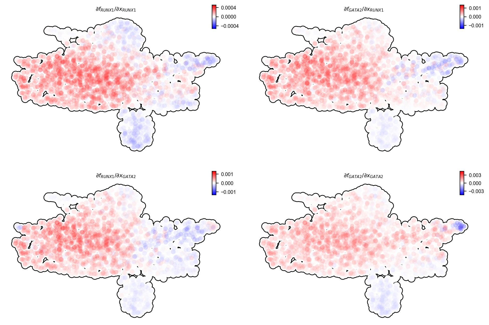
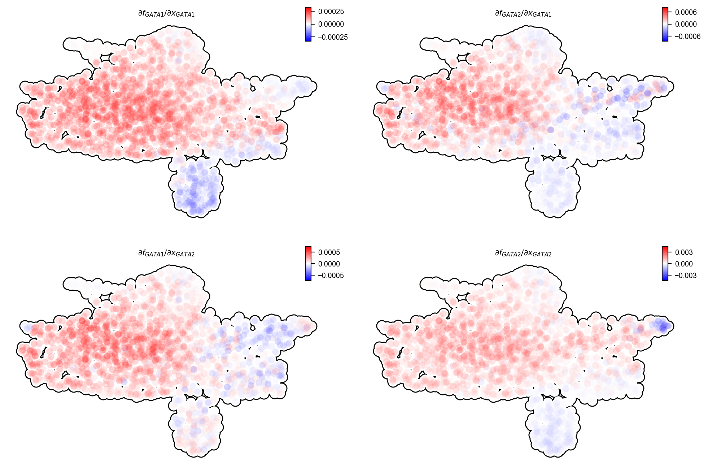

Minimal network for basophil lineage commitment
===============================================

Early studies reported that basophils are derived from GMPs (Iwasaki et
al., 2006; Truong and Ben-David, 2000). Our HSC dataset, however,
suggests that they mostly originated from MEP-like cells (with a minor
route from GMP-like cells), in line with recent scRNA-seq studies
(Drissen et al., 2016; Pellin et al., 2019). To reconcile the
discrepancy of two alternative trajectories of the Bas lineage, we
derive a minimal network model of its commitment.

In this tutorial, we will reveal a regulatory network governing the Bas
lineage’s dual origins.

Import relevant packages

.. code:: ipython3

    %%capture
    import numpy as np
    import pandas as pd
    import matplotlib.pyplot as plt
    
    # import Scribe as sb
    import sys
    import os
    
    # import scanpy as sc
    import dynamo as dyn
    import seaborn as sns
    
    dyn.dynamo_logger.main_silence()

.. code:: ipython3

    adata_labeling = dyn.sample_data.hematopoiesis()

Regulatory network governing the Bas lineage’s dual origins
-----------------------------------------------------------

Switch pair ranking analyses prioritized the involvement of CEBPA and
RUNX1, previously reported in (Guo et al., 2017), as well as GATA1, the
master regulator of the GMP lineage. Subsequent Jacobian analyses
indicate repression of RUNX1 and GATA2 by CEBPA, as well as mutual
activation between RUNX1 and GATA2 and their self-activation in
progenitors.

In this section, we will show

-  GATA2 has high expression in the Bas lineage
-  CEBPA represses RUNX1 and GATA2
-  A minimal network governing GMP vs. Bas origin of Bas lineage

GATA2 has high expression in the Bas lineage

.. code:: ipython3

    dyn.pl.scatters(adata_labeling, color=["GATA2", "cell_type"])

   

Next, we will calculate jacobian via ``dyn.vf.jacobian``. It shows that
CEBPA represses RUNX1 and GATA2.

.. code:: ipython3

    selected_genes = ["GATA2", "CEBPA", "RUNX1"]
    
    dyn.vf.jacobian(adata_labeling, regulators=selected_genes, effectors=selected_genes)
    dyn.pl.jacobian(
        adata_labeling,
        regulators="CEBPA",
        effectors=["RUNX1", "GATA2"],
        basis="umap"
    )
    

.. parsed-literal::

    Transforming subset Jacobian: 100%|██████████| 1947/1947 [00:00<00:00, 113006.61it/s]
    /Users/random/dynamo-release/dynamo/plot/vector_calculus.py:658: UserWarning: This figure includes Axes that are not compatible with tight_layout, so results might be incorrect.
      plt.tight_layout()

.. image:: output_8_1.png
   :width: 981px
   

.. code:: ipython3

    dyn.pl.jacobian(
        adata_labeling,
        effectors=["RUNX1", "GATA2"],
        basis="umap"
    )

.. parsed-literal::

    /Users/random/dynamo-release/dynamo/plot/vector_calculus.py:658: UserWarning: This figure includes Axes that are not compatible with tight_layout, so results might be incorrect.
      plt.tight_layout()

   

Jacobian analyses confirm the known repression from GATA1 to GATA2,
activation from GATA2 back to GATA1,

.. code:: ipython3

    dyn.vf.jacobian(
        adata_labeling,
        effectors=["GATA1", "GATA2"],
    )
    
    dyn.pl.jacobian(
        adata_labeling,
        effectors=["GATA1", "GATA2"],
        basis="umap"
    )

.. parsed-literal::

    Transforming subset Jacobian: 100%|██████████| 1947/1947 [00:00<00:00, 125710.96it/s]
    /Users/random/dynamo-release/dynamo/plot/vector_calculus.py:658: UserWarning: This figure includes Axes that are not compatible with tight_layout, so results might be incorrect.
      plt.tight_layout()

   

A minimal network governing GMP vs. Bas origin of Bas lineage
~~~~~~~~~~~~~~~~~~~~~~~~~~~~~~~~~~~~~~~~~~~~~~~~~~~~~~~~~~~~~

| For the network of KLF1 and FLI1 (MEP on the right in the schematic
  below), please refer to dynamo paper or our tutorial *Molecular
  mechanism of earliest and fastest appearance of megakaryocytes*.
| Collectively, analyses above reveal a network comprises the repression
  from key regulators of both GMP lineage and MEP lineage (CEBPA and
  GATA1 respectively) to the basophil master regulators GATA2 and RUNX1,
  suggesting that Bas lineage can arise via two potential trajectories,
  from either GMP or MEP cells, consistent with (Drissen et al., 2019).

.. figure:: ../hsc_images/fig5_g_iv.png
   :alt: fig5_g_iv
