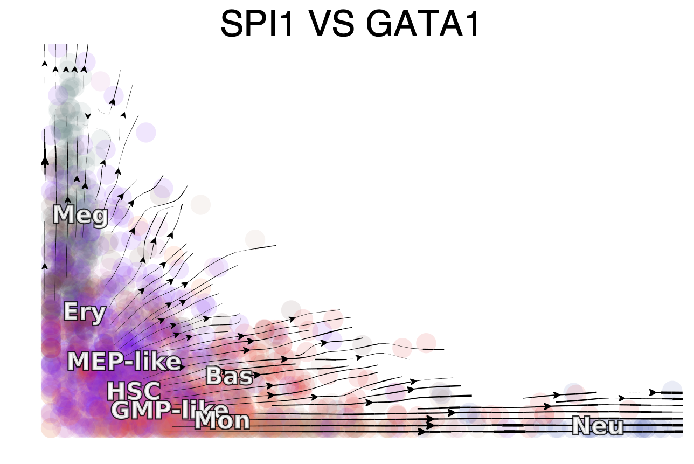
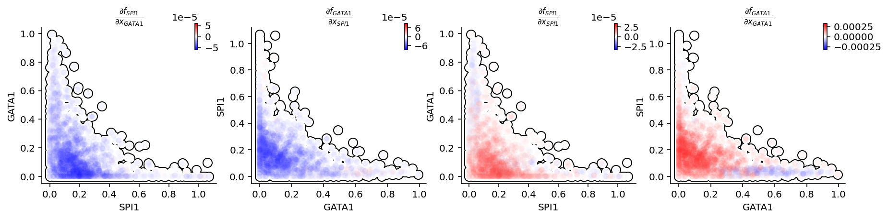
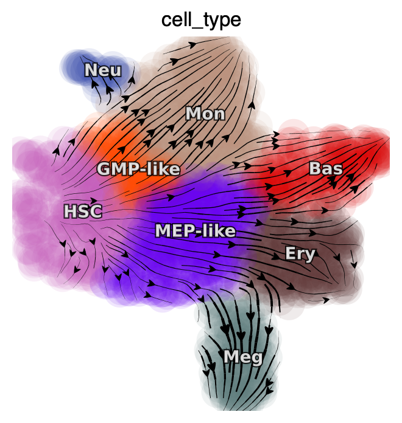
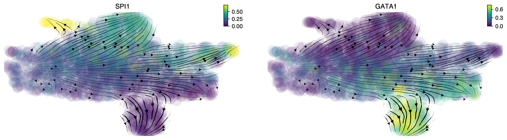
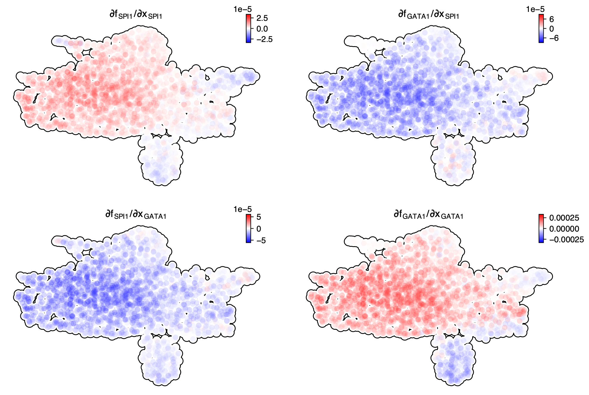
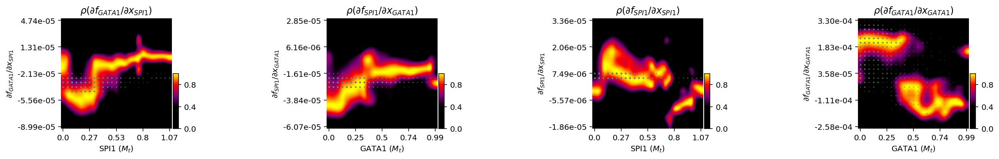

Cell-wise analyses:reveal dominant interactions across all cells
================================================================

To obtain mechanistic insights into key regulatory motifs from different
perspectives, we developed three complementary strategies: cell-wise,
trajectory-wise and plane-wise analyses. In this tutorial, we will
introduce approaches for gene network motif analysis and guide you to
perform cell-wise analyses of SPI1-GATA1 network motif.

Import relevant packages

.. code:: ipython3

    import numpy as np
    import pandas as pd
    import matplotlib.pyplot as plt
    
    # import Scribe as sb
    import sys
    import os
    
    # import scanpy as sc
    import dynamo as dyn
    import seaborn as sns
    
    dyn.dynamo_logger.main_silence()

.. code:: ipython3

    adata_labeling = dyn.sample_data.hematopoiesis()

Three approaches for in-depth network motif characterizations
-------------------------------------------------------------

The schematic graph in this section shows the three approaches. -
cell-wise analyses to reveal dominant interactions across all cells -
trajectory-wise analyses reveal trajectory dependent interactions along
a trajectory (predicted either from vector field streamline, or least
action path, see Figure 6). - Plane-wise analyses reveal direct
interactions for any characteristic cell states by varying genes of
interest while holding all other genes constant.

In the next section, we will use **cell-wise analyses** to analyze
PU.1/SPI1–GATA1 network motif.

.. figure:: ../hsc_images/fig5_h.png
   :alt: fig5_h

Cell-wise analyses of the PU.1/SPI1–GATA1 network motif across all cells
------------------------------------------------------------------------

We showcase cell-wise analyses with the canonical PU.1/SPI1-GATA1
network motif.

Streamline plot of the RNA velocities of SPI1 (x-axis) and GATA1 (y-axis)
~~~~~~~~~~~~~~~~~~~~~~~~~~~~~~~~~~~~~~~~~~~~~~~~~~~~~~~~~~~~~~~~~~~~~~~~~

The streamlines of SPI1 and GATA1 show that HSPCs bifurcate into
GMP-like and MEP-like branches

.. code:: ipython3

    dyn.configuration.set_pub_style(scaler=4)
    dyn.pl.streamline_plot(
        adata_labeling,
        color="cell_type",
        x="SPI1",
        y="GATA1",
        layer="M_t",
        ekey="M_t",
        pointsize=0.5,
        figsize=(8, 5),
        vkey="velocity_alpha_minus_gamma_s",
    )

Next we will use jacobian to show - Repression from SPI1 to GATA1, GATA1
to SPI1 - self-activation of SPI1, and GATA1, in the SPI1 and GATA1
expression space

In particular, the repression from SPI1 to GATA1 is mostly discernable
in progenitors (rectangle A: bottom left) but becomes negligible when
either GATA1 is much higher than SPI1 (rectangle B: upper left) or GATA1
is close to zero (rectangle C: bottom right).

.. code:: ipython3

    %matplotlib inline
    
    genes = ["SPI1", "GATA1"]
    def plot_jacobian_on_gene_axis(receptor, effector, x_gene=None, y_gene=None, axis_layer="M_t", temp_color_key="temp_jacobian_color", ax=None):
        if x_gene is None:
            x_gene = receptor
        if y_gene is None:
            y_gene = effector
    
        x_axis = adata_labeling[:, x_gene].layers[axis_layer].A.flatten(),
        y_axis = adata_labeling[:, y_gene].layers[axis_layer].A.flatten(),
    
        dyn.vf.jacobian(adata_labeling, regulators = [receptor, effector], effectors=[receptor, effector])
        J_df = dyn.vf.get_jacobian(
            adata_labeling,
            receptor,
            effector,
        )
        color_values = np.full(adata_labeling.n_obs, fill_value=np.nan)
        color_values[adata_labeling.obs["pass_basic_filter"]] =  J_df.iloc[:, 0]
        adata_labeling.obs[temp_color_key] = color_values
    
        ax = dyn.pl.scatters(
            adata_labeling,
            vmin=0,
            vmax=100,
            color=temp_color_key,
            cmap="bwr",
            sym_c=True,
            frontier=True,
            sort="abs",
            alpha=0.1,
            pointsize=0.1,
            x=x_axis,
            y=y_axis,
            save_show_or_return="return",
            despline=True,
            despline_sides=["right", "top"],
            deaxis=False,
            ax=ax,
        )
        ax.set_title(r"$\frac{\partial f_{%s}}{\partial x_{%s}}$" % (effector, receptor))
        ax.set_xlabel(x_gene)
        ax.set_ylabel(y_gene)
        adata_labeling.obs.pop(temp_color_key)
    
    figure, axes = plt.subplots(1, 4, figsize=(15, 3))
    plot_jacobian_on_gene_axis("GATA1", "SPI1", x_gene="SPI1", y_gene="GATA1", ax=axes[0])
    plot_jacobian_on_gene_axis("SPI1", "GATA1", x_gene="GATA1", y_gene="SPI1", ax=axes[1])
    plot_jacobian_on_gene_axis("SPI1", "SPI1", x_gene="SPI1", y_gene="GATA1", ax=axes[2])
    plot_jacobian_on_gene_axis("GATA1", "GATA1", x_gene="GATA1", y_gene="SPI1",ax=axes[3])
    plt.show()

.. parsed-literal::

    Transforming subset Jacobian: 100%|██████████| 1947/1947 [00:00<00:00, 127121.88it/s]
    Transforming subset Jacobian: 100%|██████████| 1947/1947 [00:00<00:00, 124848.03it/s]
    calculating Jacobian for each cell: 100%|██████████| 1947/1947 [00:00<00:00, 153429.97it/s]
    calculating Jacobian for each cell: 100%|██████████| 1947/1947 [00:00<00:00, 183195.59it/s]

The streamlines of SPI1 and GATA1 in UMAP space and colored by ``M_t``
show that HSPCs bifurcate into GMP-like and MEP-like branches clearly.

.. code:: ipython3

    dyn.pl.streamline_plot(
        adata_labeling,
        color=["cell_type"],
        layer="M_t",
        figsize=(4, 4),
        ncols=2
    )
    
    dyn.pl.streamline_plot(
        adata_labeling,
        color=["SPI1", "GATA1"],
        layer="M_t",
        figsize=(8, 4),
        ncols=2
    )

UMAP jacobian analysis reveals self-activation of SPI1 in GMP and GATA1
in MEP, and mutual inhibition of SPI1 and GATA1 in GMP and MEP.

.. code:: ipython3

    dyn.vf.jacobian(adata_labeling, regulators = ["SPI1", "GATA1"])
    dyn.pl.jacobian(adata_labeling, regulators = ["SPI1", "GATA1"])

.. parsed-literal::

    Transforming subset Jacobian: 100%|██████████| 1947/1947 [00:00<00:00, 127544.78it/s]

Response heatmap
~~~~~~~~~~~~~~~~

White dashed lines indicate the minimum or maximum of repression or
activation and the corresponding expression threshold.

.. code:: ipython3

    %matplotlib inline
    
    dyn.vf.jacobian(adata_labeling, regulators=["SPI1", "GATA1"], effectors=["SPI1", "GATA1"])
    dyn.pl.response(
        adata_labeling,
        np.array([["SPI1", "GATA1"], ["GATA1", "SPI1"], ["SPI1", "SPI1"], ["GATA1", "GATA1"]]),
        ykey="jacobian",
        log=False,
        drop_zero_cells=True,
        grid_num=25,
        figsize=(5, 3),
        save_show_or_return="show"
    )

.. parsed-literal::

    Transforming subset Jacobian: 100%|██████████| 1947/1947 [00:00<00:00, 125048.77it/s]

Conclusion
----------

In the analyses above, we illustrate how to use ``dynamo`` to perform
cell-wise analysis to explore the canonical PU.1/SPI1-GATA1 network
motif. A schematic diagram of the SPI1-GATA1 toggle switch model can be
summarized below.

.. figure:: ../hsc_images/fig5_I_i.png
   :alt: fig5_I_i
