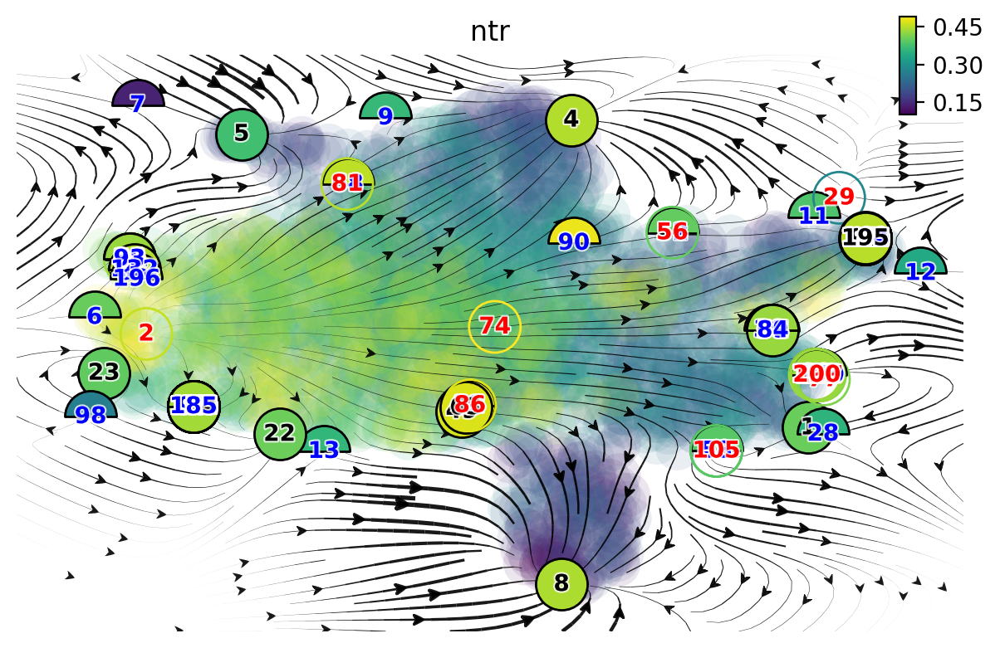
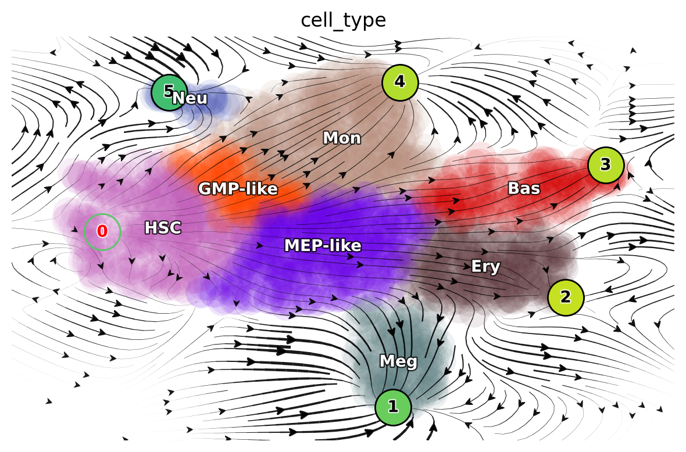
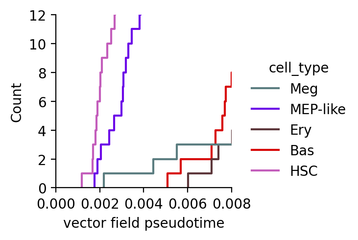
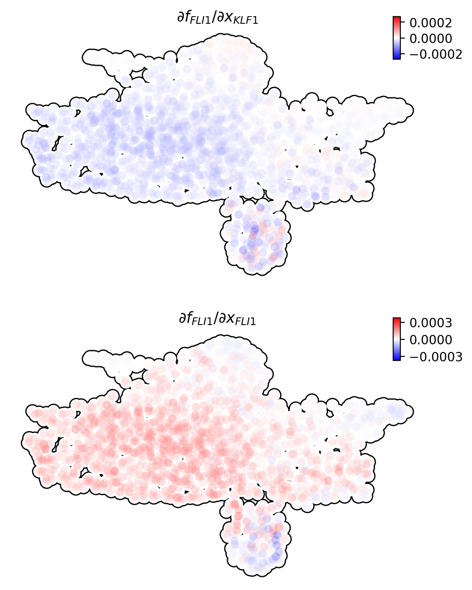

Molecular mechnism of megakaryocytes
=======================================================================

One intriguing phenomenon observed in hematopoiesis is that commitment
to and appearance of the Meg lineage occurs more rapidly than other
lineages (Sanjuan-Pla et al., 2013; Yamamoto et al., 2013). However, the
mechanisms underlying this process remain elusive. To mechanistically
dissect this finding, we focused on all cell types derived from the
MEP-like lineage.

| In this tutorial, we will guide you to 
- learn vector field and manually select fixed points 
- visualize topography with computed fixed points 
- compute pseudotime (potential) 
- visualize vector field pseudotime of cell types

Import relevant packages

.. code:: ipython3

    %%capture
    
    import numpy as np
    import pandas as pd
    import matplotlib.pyplot as plt
    
    # import Scribe as sb
    import sys
    import os
    
    # import scanpy as sc
    import dynamo as dyn
    import seaborn as sns
    
    dyn.dynamo_logger.main_silence()
    
    # filter warnings for cleaner tutorials
    import warnings
    warnings.filterwarnings('ignore')

.. code:: ipython3

    adata_labeling = dyn.sample_data.hematopoiesis()

take a glance at what is in ``adata`` object. All observations,
embedding layers and other data in ``adata`` are computed within
``dynamo``. Please refer to other dynamo tutorials regarding how to
obtain these values from metadata and raw new/total and (or) raw
spliced/unspliced gene expression values.

A schematic of leveraging differential geometry
-----------------------------------------------

-  ranking genes (using either raw or absolute values) across all cells
   or in each cell group/state
-  gene set enrichment, network construction, and visualization
-  identifying top toggle-switch pairs driving cell fate bifurcations

.. figure:: ../hsc_images/fig5_a.png
   :alt: fig5_A

Visualize topography
--------------------

Lineage tree of hematopoiesis, lumped automatically from the vector field built in the UMAP space
~~~~~~~~~~~~~~~~~~~~~~~~~~~~~~~~~~~~~~~~~~~~~~~~~~~~~~~~~~~~~~~~~~~~~~~~~~~~~~~~~~~~~~~~~~~~~~~~~

.. figure:: ../hsc_images/fig5_C.png
   :alt: fig5_C

The reconstructed vector field and associated fixed points.
~~~~~~~~~~~~~~~~~~~~~~~~~~~~~~~~~~~~~~~~~~~~~~~~~~~~~~~~~~~

The color of digits in each node reflects the type of fixed point: red,
emitting fixed point; black, absorbing fixed point. The color of the
numbered nodes corresponds to the confidence of the fixed points.

Manually select good fixed points found by topography
^^^^^^^^^^^^^^^^^^^^^^^^^^^^^^^^^^^^^^^^^^^^^^^^^^^^^

.. code:: ipython3

    adata_labeling.uns['VecFld_umap'].keys()

.. parsed-literal::

    dict_keys(['C', 'E_traj', 'P', 'V', 'VFCIndex', 'X', 'X_ctrl', 'X_data', 'Xss', 'Y', 'beta', 'confidence', 'ctrl_idx', 'ftype', 'grid', 'grid_V', 'iteration', 'method', 'nullcline', 'sigma2', 'tecr_traj', 'valid_ind', 'xlim', 'ylim'])

.. code:: ipython3

    dyn.vf.topography(adata_labeling, n=750, basis='umap');

.. code:: ipython3

    dyn.pl.topography(
        adata_labeling,
        markersize=500,
        basis="umap",
        fps_basis="umap",
        streamline_alpha=0.9,
    )

   

| In the resulted dictionary, ``Xss`` stands for the fixed points
  coordinates and ``ftype`` is the specific fixed point type, denoted by
  integers.
| ftype value mapping:
- -1: stable 
- 0: saddle 
- 1: unstable

.. code:: ipython3

    Xss, ftype = adata_labeling.uns['VecFld_umap']['Xss'], adata_labeling.uns['VecFld_umap']['ftype']
    # good_fixed_points = [0, 2, 5, 29, 11, 28] # n=250
    good_fixed_points = [2, 8, 1, 195, 4, 5] # n=750
    
    adata_labeling.uns['VecFld_umap']['Xss'] = Xss[good_fixed_points]
    adata_labeling.uns['VecFld_umap']['ftype'] = ftype[good_fixed_points]

.. code:: ipython3

    dyn.pl.topography(
        adata_labeling,
        markersize=500,
        basis="umap",
        fps_basis="umap",
        #   color=['pca_ddhodge_potential'],
        color=["cell_type"],
        streamline_alpha=0.9,
    )

   

Vector field pseudotime
-----------------------

In this section, we will show how to visualize vector field pseudotime
with ``dynamo``. The vector field pseudotime is calculated based on the
velocity transition matrix.

**Define a colormap we will use later**

.. code:: ipython3

    dynamo_color_dict = {
        "Mon": "#b88c7a",
        "Meg": "#5b7d80",
        "MEP-like": "#6c05e8",
        "Ery": "#5d373b",
        "Bas": "#d70000",
        "GMP-like": "#ff4600",
        "HSC": "#c35dbb",
        "Neu": "#2f3ea8",
    }

**Initialize a Dataframe object that we will use to plot with
visualization packages such as ``sns``**

.. code:: ipython3

    valid_cell_type = ["HSC", "MEP-like", "Meg", "Ery", "Bas"]
    valid_indices = adata_labeling.obs["cell_type"].isin(valid_cell_type)
    df = adata_labeling[valid_indices].obs[["pca_ddhodge_potential", "umap_ddhodge_potential", "cell_type"]]
    df["cell_type"] = list(df["cell_type"])

Building a graph, computing divergence and potential with ``graph_operators`` in ``dynamo``
~~~~~~~~~~~~~~~~~~~~~~~~~~~~~~~~~~~~~~~~~~~~~~~~~~~~~~~~~~~~~~~~~~~~~~~~~~~~~~~~~~~~~~~~~~~

.. code:: ipython3

    from dynamo.tools.graph_operators import build_graph, div, potential
    g = build_graph(adata_labeling.obsp["cosine_transition_matrix"])
    ddhodge_div = div(g)
    potential_cosine = potential(g, -ddhodge_div)
    adata_labeling.obs["cosine_potential"] = potential_cosine

Compute ``potential_fp`` and store in the dataframe object ``df`` we
created above. Note that ``fp`` stands for ``fokkerplanck`` method.
Please refer to the ``dynamo`` cell paper for more details on the
related methods.

.. code:: ipython3

    g = build_graph(adata_labeling.obsp["fp_transition_rate"])
    ddhodge_div = div(g)
    potential_fp = potential(g, ddhodge_div)

set ``potential_fp`` and ``pseudotime_fp`` in adata.obs to visualize
potential and time.

.. code:: ipython3

    adata_labeling.obs["potential_fp"] = potential_fp
    adata_labeling.obs["pseudotime_fp"] = -potential_fp

.. code:: ipython3

    dyn.pl.topography(
        adata_labeling,
        markersize=500,
        basis="umap",
        fps_basis="umap",
        color=["potential_fp", "pseudotime_fp"],
        streamline_alpha=0.9,
    )

   

.. code:: ipython3

    df["cosine"] = potential_cosine[valid_indices]
    df["fp"] = potential_fp[valid_indices]
    sns.displot(
        data=df,
        x="cosine",
        hue="cell_type",
        kind="ecdf",
        stat="count",
        palette=dynamo_color_dict,
        height=2.5,
        aspect=95.5 / 88.8,
    )
    plt.xlim(0.0, 0.008)
    plt.ylim(0, 12)
    plt.xlabel("vector field pseudotime")

.. parsed-literal::

    Text(0.5, 9.444444444444438, 'vector field pseudotime')

   

Via the visualization results above from vectorfield analysis, we can
observe that egakaryocytes appear earliest among the Meg, Ery, and Bas
lineages.

Molecular mechanisms underlying the early appearance of the Meg lineage
-----------------------------------------------------------------------

| In this section, we will show: 
- Self activation of FLI1 
- Repression of KLF1 by FLI1 
- FLI1 represses KLF1 
- Schematic summarizing the
interactions involving FLI1 and KLF1.

.. code:: ipython3

    Meg_genes = ["FLI1", "KLF1"]

Compute jacobian of selected genes

.. code:: ipython3

    dyn.vf.jacobian(adata_labeling, regulators=Meg_genes, effectors=Meg_genes);

.. parsed-literal::

    Transforming subset Jacobian: 100%|██████████| 1947/1947 [00:00<00:00, 120423.96it/s]

Next we use jacobian analyses to reveal mutual inhibition between FLI1
and KLF1 (Figure 5F) and self-activation of FLI1.

.. code:: ipython3

    
    dyn.pl.jacobian(
        adata_labeling,
        regulators=Meg_genes,
        effectors=["FLI1"],
        basis="umap",
    )

   

.. code:: ipython3

    dyn.pl.jacobian(
        adata_labeling,
        regulators=["KLF1"],
        effectors=["FLI1"],
        basis="umap",
    )

   

Conclusion: a schematic diagram summarizing the interactions involving FLI1 and KLF1
~~~~~~~~~~~~~~~~~~~~~~~~~~~~~~~~~~~~~~~~~~~~~~~~~~~~~~~~~~~~~~~~~~~~~~~~~~~~~~~~~~~~

Analyses above collectively suggest self-activation of FLI1 maintains
its higher expression in the HSPC state, which biases the HSPCs to first
commit towards the Meg lineage with high speed and acceleration, while
repressing the commitment into erythrocytes through inhibition of KLF1.
Together with the mutual regulation we show ealier in this tutorial, we
can generate the following schematic to summarize the gene network.

.. figure:: ../hsc_images/fig5_f_iv.png
   :alt: fig5_f_iv