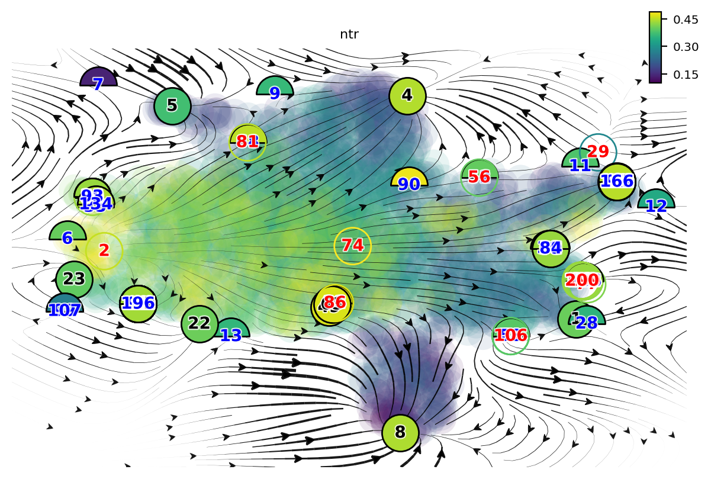
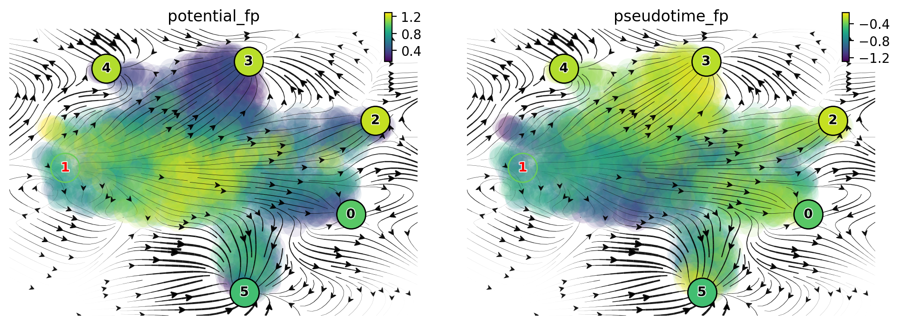
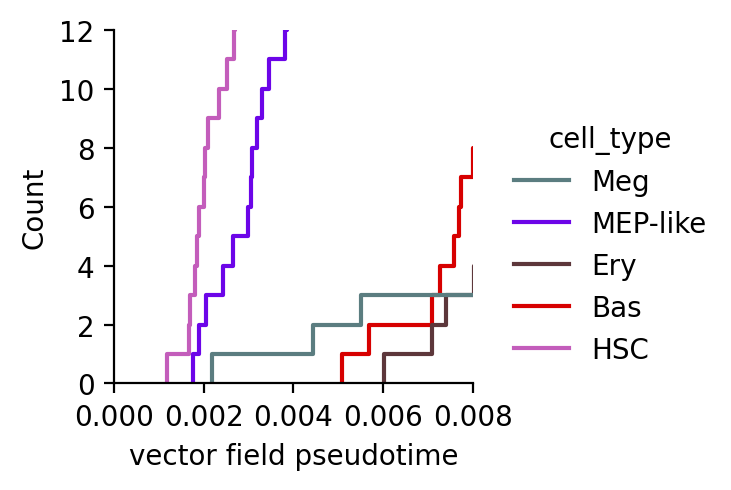
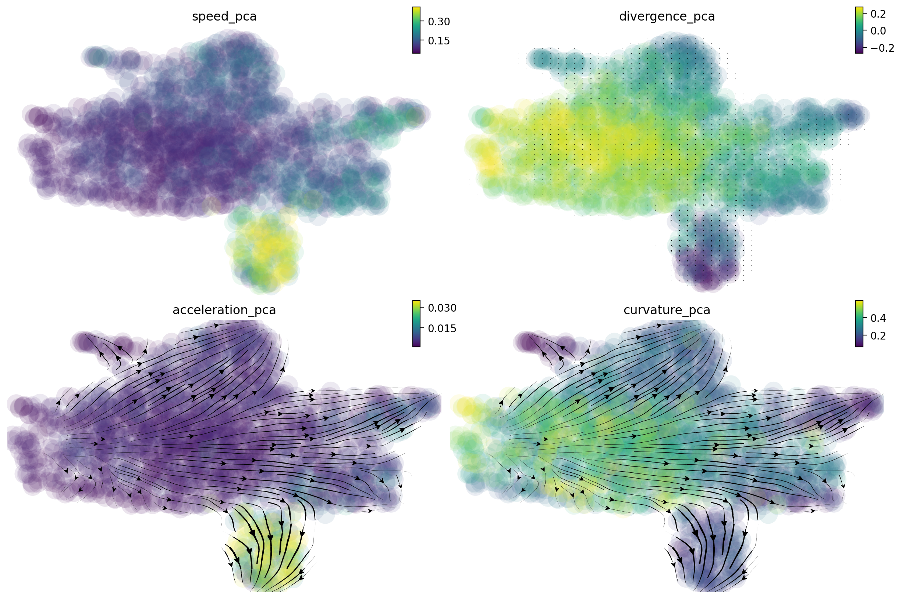
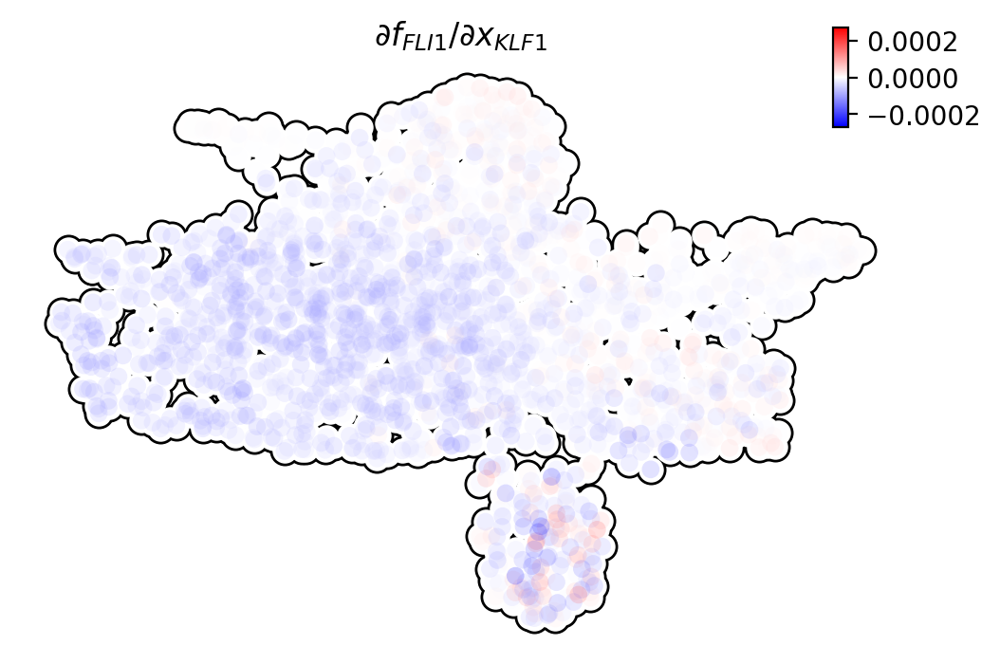

Molecular mechnism of earliest and fastest appearance of megakaryocytes
=======================================================================

One intriguing phenomenon observed in hematopoiesis is that commitment
to and appearance of the Meg lineage occurs more rapidly than other
lineages (Sanjuan-Pla et al., 2013; Yamamoto et al., 2013). However, the
mechanisms underlying this process remain elusive. To mechanistically
dissect this finding, we focused on all cell types derived from the
MEP-like lineage.

In this tutorial, we will guide you to - learn vector field and manually
select fixed points - visualize topography with computed fixed points -
compute pseudotime (potential) - visualize vector field pseudotime of
cell types

Import relevant packages

.. code:: ipython3

    !pip install git+https://github.com/aristoteleo/dynamo-release@master

.. code:: ipython3

    %%capture
    
    import numpy as np
    import pandas as pd
    import matplotlib.pyplot as plt
    
    # import Scribe as sb
    import sys
    import os
    
    # import scanpy as sc
    import dynamo as dyn
    import seaborn as sns
    
    dyn.dynamo_logger.main_silence()
    
    # filter warnings for cleaner tutorials
    import warnings
    warnings.filterwarnings('ignore')

.. code:: ipython3

    adata_labeling = dyn.sample_data.hematopoiesis()

take a glance at what is in ``adata`` object. All observations,
embedding layers and other data in ``adata`` are computed within
``dynamo``. Please refer to other dynamo tutorials regarding how to
obtain these values from metadata and raw new/total and (or) raw
spliced/unspliced gene expression values.

A schematic of leveraging differential geometry
-----------------------------------------------

-  ranking genes (using either raw or absolute values) across all cells
   or in each cell group/state
-  gene set enrichment, network construction, and visualization
-  identifying top toggle-switch pairs driving cell fate bifurcations

.. figure:: https://github.com/aristoteleo/dynamo-tutorials/blob/master/images/fig5_a.png?raw=1
   :alt: fig5_A

   fig5_A

Visualize topography
--------------------

Lineage tree of hematopoiesis, lumped automatically from the vector field built in the UMAP space
~~~~~~~~~~~~~~~~~~~~~~~~~~~~~~~~~~~~~~~~~~~~~~~~~~~~~~~~~~~~~~~~~~~~~~~~~~~~~~~~~~~~~~~~~~~~~~~~~

.. figure:: https://github.com/aristoteleo/dynamo-tutorials/blob/master/images/fig5_C.png?raw=1
   :alt: fig5_C

   fig5_C

The reconstructed vector field and associated fixed points.
~~~~~~~~~~~~~~~~~~~~~~~~~~~~~~~~~~~~~~~~~~~~~~~~~~~~~~~~~~~

The color of digits in each node reflects the type of fixed point: red,
emitting fixed point; black, absorbing fixed point. The color of the
numbered nodes corresponds to the confidence of the fixed points.

Manually select good fixed points found by topography
^^^^^^^^^^^^^^^^^^^^^^^^^^^^^^^^^^^^^^^^^^^^^^^^^^^^^

.. code:: ipython3

    adata_labeling.uns["VecFld_umap"].keys()

.. parsed-literal::

    dict_keys(['C', 'E_traj', 'P', 'V', 'VFCIndex', 'X', 'X_ctrl', 'X_data', 'Xss', 'Y', 'beta', 'confidence', 'ctrl_idx', 'ftype', 'grid', 'grid_V', 'iteration', 'method', 'nullcline', 'sigma2', 'tecr_traj', 'valid_ind', 'xlim', 'ylim'])

.. code:: ipython3

    dyn.vf.topography(adata_labeling, n=750, basis="umap")

.. parsed-literal::

    |-----> method arg is None, choosing methods automatically...
    |-----------> method kd_tree selected

.. parsed-literal::

    AnnData object with n_obs × n_vars = 1947 × 1956
        obs: 'batch', 'time', 'cell_type', 'nGenes', 'nCounts', 'pMito', 'pass_basic_filter', 'new_Size_Factor', 'initial_new_cell_size', 'total_Size_Factor', 'initial_total_cell_size', 'spliced_Size_Factor', 'initial_spliced_cell_size', 'unspliced_Size_Factor', 'initial_unspliced_cell_size', 'Size_Factor', 'initial_cell_size', 'ntr', 'cell_cycle_phase', 'leiden', 'control_point_pca', 'inlier_prob_pca', 'obs_vf_angle_pca', 'pca_ddhodge_div', 'pca_ddhodge_potential', 'acceleration_pca', 'curvature_pca', 'n_counts', 'mt_frac', 'jacobian_det_pca', 'manual_selection', 'divergence_pca', 'curv_leiden', 'curv_louvain', 'SPI1->GATA1_jacobian', 'jacobian', 'umap_ori_leiden', 'umap_ori_louvain', 'umap_ddhodge_div', 'umap_ddhodge_potential', 'curl_umap', 'divergence_umap', 'acceleration_umap', 'control_point_umap_ori', 'inlier_prob_umap_ori', 'obs_vf_angle_umap_ori', 'curvature_umap_ori'
        var: 'gene_name', 'gene_id', 'nCells', 'nCounts', 'pass_basic_filter', 'use_for_pca', 'frac', 'ntr', 'time_3_alpha', 'time_3_beta', 'time_3_gamma', 'time_3_half_life', 'time_3_alpha_b', 'time_3_alpha_r2', 'time_3_gamma_b', 'time_3_gamma_r2', 'time_3_gamma_logLL', 'time_3_delta_b', 'time_3_delta_r2', 'time_3_bs', 'time_3_bf', 'time_3_uu0', 'time_3_ul0', 'time_3_su0', 'time_3_sl0', 'time_3_U0', 'time_3_S0', 'time_3_total0', 'time_3_beta_k', 'time_3_gamma_k', 'time_5_alpha', 'time_5_beta', 'time_5_gamma', 'time_5_half_life', 'time_5_alpha_b', 'time_5_alpha_r2', 'time_5_gamma_b', 'time_5_gamma_r2', 'time_5_gamma_logLL', 'time_5_bs', 'time_5_bf', 'time_5_uu0', 'time_5_ul0', 'time_5_su0', 'time_5_sl0', 'time_5_U0', 'time_5_S0', 'time_5_total0', 'time_5_beta_k', 'time_5_gamma_k', 'use_for_dynamics', 'gamma', 'gamma_r2', 'use_for_transition', 'gamma_k', 'gamma_b'
        uns: 'PCs', 'VecFld_pca', 'VecFld_umap', 'X_umap_neighbors', 'cell_phase_genes', 'cell_type_colors', 'dynamics', 'explained_variance_ratio_', 'feature_selection', 'grid_velocity_pca', 'grid_velocity_umap', 'grid_velocity_umap_ori_perturbation', 'grid_velocity_umap_test', 'jacobian_pca', 'leiden', 'neighbors', 'pca_mean', 'pp', 'response'
        obsm: 'X', 'X_pca', 'X_pca_SparseVFC', 'X_umap', 'X_umap_SparseVFC', 'X_umap_ori_perturbation', 'X_umap_test', 'acceleration_pca', 'acceleration_umap', 'cell_cycle_scores', 'curvature_pca', 'curvature_umap', 'j_delta_x_perturbation', 'velocity_pca', 'velocity_pca_SparseVFC', 'velocity_umap', 'velocity_umap_SparseVFC', 'velocity_umap_ori_perturbation', 'velocity_umap_test'
        layers: 'M_n', 'M_nn', 'M_t', 'M_tn', 'M_tt', 'X_new', 'X_total', 'velocity_alpha_minus_gamma_s'
        obsp: 'X_umap_connectivities', 'X_umap_distances', 'connectivities', 'cosine_transition_matrix', 'distances', 'fp_transition_rate', 'moments_con', 'pca_ddhodge', 'perturbation_transition_matrix', 'umap_ddhodge'

.. code:: ipython3

    dyn.pl.topography(
        adata_labeling,
        markersize=500,
        basis="umap",
        fps_basis="umap",
        streamline_alpha=0.9,
    )

| In the resulted dictionary, ``Xss`` stands for the fixed points
  coordinates and ``ftype`` is the specific fixed point type, denoted by
  integers.
| ftype value mapping:
| - -1: stable - 0: saddle - 1: unstable

.. code:: ipython3

    Xss, ftype = adata_labeling.uns["VecFld_umap"]["Xss"], adata_labeling.uns["VecFld_umap"]["ftype"]
    good_fixed_points = [1, 2, 3, 4, 5, 8]  # n=750
    
    adata_labeling.uns["VecFld_umap"]["Xss"] = Xss[good_fixed_points]
    adata_labeling.uns["VecFld_umap"]["ftype"] = ftype[good_fixed_points]

.. code:: ipython3

    dyn.pl.topography(
        adata_labeling,
        markersize=500,
        basis="umap",
        fps_basis="umap",
        #   color=['pca_ddhodge_potential'],
        color=["cell_type"],
        streamline_alpha=0.9,
    )

Vector field pseudotime
-----------------------

In this section, we will show how to visualize vector field pseudotime
with ``dynamo``. The vector field pseudotime is calculated based on the
velocity transition matrix.

**Define a colormap we will use later**

.. code:: ipython3

    dynamo_color_dict = {
        "Mon": "#b88c7a",
        "Meg": "#5b7d80",
        "MEP-like": "#6c05e8",
        "Ery": "#5d373b",
        "Bas": "#d70000",
        "GMP-like": "#ff4600",
        "HSC": "#c35dbb",
        "Neu": "#2f3ea8",
    }

**Initialize a Dataframe object that we will use to plot with
visualization packages such as ``sns``**

.. code:: ipython3

    valid_cell_type = ["HSC", "MEP-like", "Meg", "Ery", "Bas"]
    valid_indices = adata_labeling.obs["cell_type"].isin(valid_cell_type)
    df = adata_labeling[valid_indices].obs[["pca_ddhodge_potential", "umap_ddhodge_potential", "cell_type"]]
    df["cell_type"] = list(df["cell_type"])

Building a graph, computing divergence and potential with ``graph_operators`` in ``dynamo``
~~~~~~~~~~~~~~~~~~~~~~~~~~~~~~~~~~~~~~~~~~~~~~~~~~~~~~~~~~~~~~~~~~~~~~~~~~~~~~~~~~~~~~~~~~~

.. code:: ipython3

    from dynamo.tools.graph_operators import build_graph, div, potential
    
    g = build_graph(adata_labeling.obsp["cosine_transition_matrix"])
    ddhodge_div = div(g)
    potential_cosine = potential(g, -ddhodge_div)
    adata_labeling.obs["cosine_potential"] = potential_cosine

Compute ``potential_fp`` and store in the dataframe object ``df`` we
created above. Note that ``fp`` stands for ``fokkerplanck`` method.
Please refer to the ``dynamo`` cell paper for more details on the
related methods.

.. code:: ipython3

    g = build_graph(adata_labeling.obsp["fp_transition_rate"])
    ddhodge_div = div(g)
    potential_fp = potential(g, ddhodge_div)

set ``potential_fp`` and ``pseudotime_fp`` in adata.obs to visualize
potential and time.

.. code:: ipython3

    adata_labeling.obs["potential_fp"] = potential_fp
    adata_labeling.obs["pseudotime_fp"] = -potential_fp

.. code:: ipython3

    dyn.pl.topography(
        adata_labeling,
        markersize=500,
        basis="umap",
        fps_basis="umap",
        color=["potential_fp", "pseudotime_fp"],
        streamline_alpha=0.9,
    )

.. code:: ipython3

    df["cosine"] = potential_cosine[valid_indices]
    df["fp"] = potential_fp[valid_indices]
    sns.displot(
        data=df,
        x="cosine",
        hue="cell_type",
        kind="ecdf",
        stat="count",
        palette=dynamo_color_dict,
        height=2.5,
        aspect=95.5 / 88.8,
    )
    plt.xlim(0.0, 0.008)
    plt.ylim(0, 12)
    plt.xlabel("vector field pseudotime")
    plt.show()

Via the visualization results above from vectorfield analysis, we can
observe that egakaryocytes appear earliest among the Meg, Ery, and Bas
lineages.

Molecular mechanisms underlying the early appearance of the Meg lineage
-----------------------------------------------------------------------

In this section, we will show: - Self- activation of FLI1 - Repression
of KLF1 by FLI1 - FLI1 represses KLF1 - Speed, acceleration and
divergence calculation and visualization - Schematic summarizing the
interactions involving FLI1 and KLF1.

.. code:: ipython3

    Meg_genes = ["FLI1", "KLF1"]

Compute jacobian of selected genes

.. code:: ipython3

    dyn.vf.jacobian(adata_labeling, regulators=Meg_genes, effectors=Meg_genes)

.. parsed-literal::

    Transforming subset Jacobian: 100%|██████████| 1947/1947 [00:00<00:00, 62952.39it/s]

.. parsed-literal::

    AnnData object with n_obs × n_vars = 1947 × 1956
        obs: 'batch', 'time', 'cell_type', 'nGenes', 'nCounts', 'pMito', 'pass_basic_filter', 'new_Size_Factor', 'initial_new_cell_size', 'total_Size_Factor', 'initial_total_cell_size', 'spliced_Size_Factor', 'initial_spliced_cell_size', 'unspliced_Size_Factor', 'initial_unspliced_cell_size', 'Size_Factor', 'initial_cell_size', 'ntr', 'cell_cycle_phase', 'leiden', 'control_point_pca', 'inlier_prob_pca', 'obs_vf_angle_pca', 'pca_ddhodge_div', 'pca_ddhodge_potential', 'acceleration_pca', 'curvature_pca', 'n_counts', 'mt_frac', 'jacobian_det_pca', 'manual_selection', 'divergence_pca', 'curv_leiden', 'curv_louvain', 'SPI1->GATA1_jacobian', 'jacobian', 'umap_ori_leiden', 'umap_ori_louvain', 'umap_ddhodge_div', 'umap_ddhodge_potential', 'curl_umap', 'divergence_umap', 'acceleration_umap', 'control_point_umap_ori', 'inlier_prob_umap_ori', 'obs_vf_angle_umap_ori', 'curvature_umap_ori', 'cosine_potential', 'potential_fp', 'pseudotime_fp'
        var: 'gene_name', 'gene_id', 'nCells', 'nCounts', 'pass_basic_filter', 'use_for_pca', 'frac', 'ntr', 'time_3_alpha', 'time_3_beta', 'time_3_gamma', 'time_3_half_life', 'time_3_alpha_b', 'time_3_alpha_r2', 'time_3_gamma_b', 'time_3_gamma_r2', 'time_3_gamma_logLL', 'time_3_delta_b', 'time_3_delta_r2', 'time_3_bs', 'time_3_bf', 'time_3_uu0', 'time_3_ul0', 'time_3_su0', 'time_3_sl0', 'time_3_U0', 'time_3_S0', 'time_3_total0', 'time_3_beta_k', 'time_3_gamma_k', 'time_5_alpha', 'time_5_beta', 'time_5_gamma', 'time_5_half_life', 'time_5_alpha_b', 'time_5_alpha_r2', 'time_5_gamma_b', 'time_5_gamma_r2', 'time_5_gamma_logLL', 'time_5_bs', 'time_5_bf', 'time_5_uu0', 'time_5_ul0', 'time_5_su0', 'time_5_sl0', 'time_5_U0', 'time_5_S0', 'time_5_total0', 'time_5_beta_k', 'time_5_gamma_k', 'use_for_dynamics', 'gamma', 'gamma_r2', 'use_for_transition', 'gamma_k', 'gamma_b'
        uns: 'PCs', 'VecFld_pca', 'VecFld_umap', 'X_umap_neighbors', 'cell_phase_genes', 'cell_type_colors', 'dynamics', 'explained_variance_ratio_', 'feature_selection', 'grid_velocity_pca', 'grid_velocity_umap', 'grid_velocity_umap_ori_perturbation', 'grid_velocity_umap_test', 'jacobian_pca', 'leiden', 'neighbors', 'pca_mean', 'pp', 'response'
        obsm: 'X', 'X_pca', 'X_pca_SparseVFC', 'X_umap', 'X_umap_SparseVFC', 'X_umap_ori_perturbation', 'X_umap_test', 'acceleration_pca', 'acceleration_umap', 'cell_cycle_scores', 'curvature_pca', 'curvature_umap', 'j_delta_x_perturbation', 'velocity_pca', 'velocity_pca_SparseVFC', 'velocity_umap', 'velocity_umap_SparseVFC', 'velocity_umap_ori_perturbation', 'velocity_umap_test'
        layers: 'M_n', 'M_nn', 'M_t', 'M_tn', 'M_tt', 'X_new', 'X_total', 'velocity_alpha_minus_gamma_s'
        obsp: 'X_umap_connectivities', 'X_umap_distances', 'connectivities', 'cosine_transition_matrix', 'distances', 'fp_transition_rate', 'moments_con', 'pca_ddhodge', 'perturbation_transition_matrix', 'umap_ddhodge'

Next we use jacobian analyses to reveal mutual inhibition between FLI1
and KLF1 (Figure 5F) and self-activation of FLI1.

.. code:: ipython3

    dyn.pl.jacobian(
        adata_labeling,
        regulators=Meg_genes,
        effectors=["FLI1"],
        basis="umap",
    )

.. image:: output_37_0.png

.. code:: ipython3

    dyn.pl.jacobian(
        adata_labeling,
        regulators=["KLF1"],
        effectors=["FLI1"],
        basis="umap",
    )

.. image:: output_38_0.png

Expression of FLI1 (Meg lineage master regulator) relative to KLF1 (Ery
lineage master regulator) in progenitors.

.. code:: ipython3

    dyn.pl.umap(adata_labeling, color=["FLI1", "KLF1"], layer="X_total")

Computing and visualizing speed, divergence, acceleration and curvature
~~~~~~~~~~~~~~~~~~~~~~~~~~~~~~~~~~~~~~~~~~~~~~~~~~~~~~~~~~~~~~~~~~~~~~~

In this subsection we will show that megakaryocytes have the largest RNA
speed (velocitymagnitude) among all celltypes. Same as our other
published notebook usage examples, we can use methods from ``dyn.vf`` to
calculate speed, divergence, acceleration and curvature within specific
basis. In the following code cell, we select ``pca`` as the basis.

.. code:: ipython3

    basis = "pca"
    dyn.vf.speed(adata_labeling, basis=basis)
    dyn.vf.divergence(adata_labeling, basis=basis)
    dyn.vf.acceleration(adata_labeling, basis=basis)
    dyn.vf.curvature(adata_labeling, basis=basis)

.. parsed-literal::

    Calculating divergence: 0it [00:00, ?it/s]

.. code:: ipython3

    adata_labeling.obs["speed_" + basis][:5]

.. parsed-literal::

    barcode
    CCACAAGCGTGC-JL12_0    0.116313
    CCATCCTGTGGA-JL12_0    0.410604
    CCCTCGGCCGCA-JL12_0    0.086653
    CCGCCCACCATG-JL12_0    0.145851
    CCGCTGTGTAAG-JL12_0    0.096051
    Name: speed_pca, dtype: float64

| The results are saved to {quantity}\_{basis} (e.g. ``speed_pca``).
  Then we can visualize via various visualization results.
| In the result below, we can observe the patterns of dynamics
  quantities including speed are consistent with the function of FLI1
  (Meg lineage master regulator) and KLF1 (Ery lineage master
  regulator).

.. code:: ipython3

    import matplotlib.pyplot as plt
    
    fig, axes = plt.subplots(ncols=2, nrows=2, constrained_layout=True, figsize=(12, 8))
    axes
    dyn.pl.umap(adata_labeling, color="speed_" + basis, ax=axes[0, 0], save_show_or_return="return")
    dyn.pl.grid_vectors(
        adata_labeling,
        color="divergence_" + basis,
        ax=axes[0, 1],
        quiver_length=12,
        quiver_size=12,
        save_show_or_return="return",
    )
    dyn.pl.streamline_plot(adata_labeling, color="acceleration_" + basis, ax=axes[1, 0], save_show_or_return="return")
    dyn.pl.streamline_plot(adata_labeling, color="curvature_" + basis, ax=axes[1, 1], save_show_or_return="return")
    plt.show()

.. parsed-literal::

    |-----> method arg is None, choosing methods automatically...
    |-----------> method kd_tree selected
    |-----> method arg is None, choosing methods automatically...
    |-----------> method kd_tree selected
    |-----> method arg is None, choosing methods automatically...
    |-----------> method kd_tree selected

It is clear that the Meg lineage has the highest RNA speed, acceleration
and curvature while the lowest divergence across all lineages. The
curvature for the Meg lineage is also low.

In order to reveal the underlying regulatory mechanism governing this
early appearance, we perform RNA Jacobian analyses for these two master
regulators. Our Jacobian analyses revealed mutual inhibition between
FLI1 and KLF1 and self-activation of FLI1 (Truong and Ben-David, 2000).
More details can be found in the following:

Compute RNA Jacobian between the two master regulators: FLI1 and KLF1.

.. code:: ipython3

    Meg_genes = ["FLI1", "KLF1"]
    dyn.vf.jacobian(adata_labeling, regulators=Meg_genes, effectors=Meg_genes);

.. parsed-literal::

    Transforming subset Jacobian: 100%|██████████| 1947/1947 [00:00<00:00, 37278.36it/s]

Next we will visualize the RNA Jacobian between FLI1 and KLF1 across
cells. From the figure shown below, it is clear that FLI1 represses KLF1
(the blue color indicates negative Jacobian) while there is a
self-activation for FLI1 (the red color indicates positive Jacobian).

.. code:: ipython3

    dyn.pl.jacobian(
        adata_labeling,
        regulators=Meg_genes,
        effectors=["FLI1"],
        basis="umap",
    )

.. image:: output_49_0.png

.. code:: ipython3

    dyn.pl.jacobian(
        adata_labeling,
        regulators=["KLF1"],
        effectors=["FLI1"],
        basis="umap",
    )

Conclusion: a schematic diagram summarizing the interactions involving FLI1 and KLF1
~~~~~~~~~~~~~~~~~~~~~~~~~~~~~~~~~~~~~~~~~~~~~~~~~~~~~~~~~~~~~~~~~~~~~~~~~~~~~~~~~~~~

Analyses above collectively suggest self-activation of FLI1 maintains
its higher expression in the HSPC state, which biases the HSPCs to first
commit towards the Meg lineage with high speed and acceleration, while
repressing the commitment into erythrocytes through inhibition of KLF1.
Together with the mutual regulation we show ealier in this tutorial, we
can generate the following schematic to summarize the gene network.

.. figure:: https://github.com/aristoteleo/dynamo-tutorials/blob/master/images/fig5_f_iv.png?raw=1
   :alt: fig5_f_iv

   fig5_f_iv
