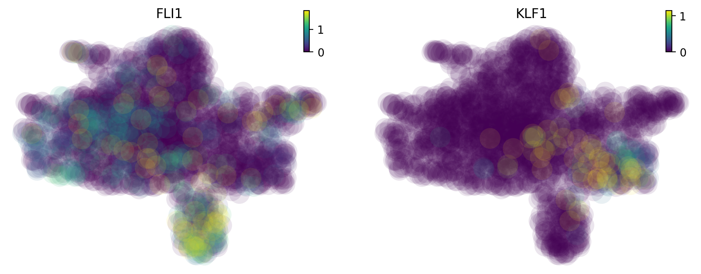

.. raw:: html

    

      
      
    

Molecular mechanism of megakaryocytes
=======================================================================

One intriguing phenomenon observed in hematopoiesis is that commitment
to and appearance of the Meg lineage occurs more rapidly than other
lineages (Sanjuan-Pla et al., 2013; Yamamoto et al., 2013). However, the
mechanisms underlying this process remain elusive. To mechanistically
investigate these findings, we try to first reveal the timing of the maturation of
megakaryocytes and then the underlying regulatory networks.

Specifically, in this tutorial, we will guide you through the following three
major analyses:

- learn vector field of human hematopoiesis and identify fixed points of cell type
- compute and visualize vector field based pseudotime (based on ddhodge algorithm)
- perform differential geometry analyses to reveal a minimal network of Meg's early appearance

To begin with, let us first import relevant packages

.. code:: ipython3

    %%capture
    
    import numpy as np
    import pandas as pd
    import matplotlib.pyplot as plt

    import sys
    import os
    
    import dynamo as dyn
    import seaborn as sns
    
    dyn.dynamo_logger.main_silence()
    
    # filter warnings for cleaner tutorials
    import warnings
    warnings.filterwarnings('ignore')

Next, let us download the processed hematopoiesis adata object
(see `this notebook <https://dynamo-release.readthedocs.io/en/latest/notebooks/tutorial_hsc_velocity.html>`_
to find out how to estimate the labeling RNA velocity for
this dataset) that comes with the dynamo package.

.. code:: ipython3

    adata_labeling = dyn.sample_data.hematopoiesis()

Before we perform the actual analyses, we will first introduce a cartoon that can be used to help understanding
how dynamo can be used to perform many novel analyses that are not available with any other tools to gain
mechanistic insights.

How to use dynamo to gain mechanistic insights with its unique differential geometry analyses
----------------------------------------------------------------------------------------------
In general, from the RNA velocity data, we can learn the vector field function in high dimensional
space and then we can use it to perform differential analyses and gene-set enrichment analyses
based on top-ranked acceleration or curvature genes, as well as the top-ranked genes with the
strongest self-interactions, top-ranked regulators/targets, or top-ranked interactions for each
gene in individual cell types or across all cell types, with either raw or absolute values.
Integrating that ranking information, we can build regulatory networks across different cell types,
which can then be visualized with ArcPlot, CircosPlot, or other visualizations. Lastly, dynamo can be also
used to identify top toggle-switch pairs driving cell-fate bifurcations. We will discuss parts of these
analyses in this notebook but you should also check the extensive analyses demonstrated in the zebrafish
differential geometry analyses notebook from here:
`Zebrafish <https://dynamo-release.readthedocs.io/en/latest/notebooks/Differential_geometry.html>`_

.. figure:: ../hsc_images/fig5_a.png
   :alt: fig5_A

Map the topography of human hematopoiesis and associative fixed points
----------------------------------------------------------------------

To map the topography of a vector field space, we will need to first learn the vector field function in that space which
can be done with the following code. Since the data we preprocessed in dynamo already include the vector field in the
umap space. The following step can be skipped.

.. code:: ipython3
    dyn.vf.VectorField(adata_labeling, basis='umap', map_topography=False) # learn vector field for the umap space

Associate fixed points to cell types
^^^^^^^^^^^^^^^^^^^^^^^^^^^^^^^^^^^^

We next run the `vf.topography` function to retrieve fixed points. Because of the numerical instability of the learned
vector field resulted from the noisy data, dynamo tends to identify many fixed points. Manually post-processing will be
needed to associate each fix point to a particular cell state.

.. code:: ipython3
    adata_labeling.uns['VecFld_umap'].keys()

.. parsed-literal::

    dict_keys(['C', 'E_traj', 'P', 'V', 'VFCIndex', 'X', 'X_ctrl', 'X_data', 'Xss', 'Y', 'beta', 'confidence', 'ctrl_idx', 'ftype', 'grid', 'grid_V', 'iteration', 'method', 'nullcline', 'sigma2', 'tecr_traj', 'valid_ind', 'xlim', 'ylim'])

.. code:: ipython3

    dyn.vf.topography(adata_labeling, n=750, basis='umap');

.. code:: ipython3

    dyn.pl.topography(
        adata_labeling,
        markersize=500,
        basis="umap",
        fps_basis="umap",
        streamline_alpha=0.9,
    )

.. image:: output_13_0.png
   :width: 602px
   

As you can see, we have way more fixed points than we want. Therefore we manually select fixed points, simply by
identifying points that are associated with a particular cell fate. Specifically, we will also leverage the
``Xss, ftype`` keys that are associated with all those identified fixed points.

| here ``Xss`` is for the fixed points
  coordinates while ``ftype`` is for the specific fixed point type, denoted by
  integers.
| the integers of fixed points in ftype have following meaning:
- -1: stable 
- 0: saddle 
- 1: unstable

In the following figure, the color of digits in each node reflects the type of fixed point: red,
emitting fixed point; black, absorbing fixed point. The color of the numbered nodes corresponds to
the confidence of the fixed points with lighter (yellowish color) higher confidence and vice versa.

.. code:: ipython3

    Xss, ftype = adata_labeling.uns['VecFld_umap']['Xss'], adata_labeling.uns['VecFld_umap']['ftype']
    # good_fixed_points = [0, 2, 5, 29, 11, 28] # n=250
    good_fixed_points = [2, 8, 1, 195, 4, 5] # n=750
    
    adata_labeling.uns['VecFld_umap']['Xss'] = Xss[good_fixed_points]
    adata_labeling.uns['VecFld_umap']['ftype'] = ftype[good_fixed_points]

.. code:: ipython3

    dyn.pl.topography(
        adata_labeling,
        markersize=500,
        basis="umap",
        fps_basis="umap",
        #   color=['pca_ddhodge_potential'],
        color=["cell_type"],
        streamline_alpha=0.9,
    )

.. image:: output_16_0.png
   :width: 590px
   
It is worth noting that those fixed points are later used in the optimal path predictions as shown here:
`LAP <https://dynamo-release.readthedocs.io/en/latest/notebooks/lap_tutorial/lap_tutorial.html>`_

Lineage tree of hematopoiesis
~~~~~~~~~~~~~~~~~~~~~~~~~~~~~
We can then run the ``dyn.pd.tree_model(adata_labeling)`` function to lumped cells from each population from the vector
field built in the UMAP space to create a lineage tree that nicely recapitulate the known hierarchy of each cell lineage.

.. figure:: ../hsc_images/fig5_c.png
   :alt: fig5_c

Vector field pseudotime
-----------------------
We now move to demonstrate how we can use dynamo to reveal the early appearance of Meg lineage. Specifically we use
ddhodge to calculate the vector field based pseudotime with the velocity transition matrix. More details can be found in
the following:

**Define a colormap we will use later**

.. code:: ipython3

    dynamo_color_dict = {
        "Mon": "#b88c7a",
        "Meg": "#5b7d80",
        "MEP-like": "#6c05e8",
        "Ery": "#5d373b",
        "Bas": "#d70000",
        "GMP-like": "#ff4600",
        "HSC": "#c35dbb",
        "Neu": "#2f3ea8",
    }

**Initialize a Dataframe object that we will use for plotting with ``sns`` or ``matplotlib`` **

.. code:: ipython3

    valid_cell_type = ["HSC", "MEP-like", "Meg", "Ery", "Bas"]
    valid_indices = adata_labeling.obs["cell_type"].isin(valid_cell_type)
    df = adata_labeling[valid_indices].obs[["pca_ddhodge_potential", "umap_ddhodge_potential", "cell_type"]]
    df["cell_type"] = list(df["cell_type"])

Use ddhodge algorith from ``dynamo`` to compute vector field based pseudotime
~~~~~~~~~~~~~~~~~~~~~~~~~~~~~~~~~~~~~~~~~~~~~~~~~~~~~~~~~~~~~~~~~~~~~~~~~~~~~

.. code:: ipython3

    from dynamo.tools.graph_operators import build_graph, div, potential
    g = build_graph(adata_labeling.obsp["cosine_transition_matrix"])
    ddhodge_div = div(g)
    potential_cosine = potential(g, -ddhodge_div)
    adata_labeling.obs["cosine_potential"] = potential_cosine

The above uses the `cosine_transition_matrix` to compute the vector field based pseudotiem but you can also
compute it with other kernels, such as the ``fp_transition_rate`` and store the results in the dataframe object ``df``
we created above. Note that ``fp`` stands for ``fokker planck`` method.
Please refer to the ``dynamo`` documentation for more details on the
related methods.

.. code:: ipython3

    g = build_graph(adata_labeling.obsp["fp_transition_rate"])
    ddhodge_div = div(g)
    potential_fp = potential(g, ddhodge_div)

set ``potential_fp`` and ``pseudotime_fp`` in adata.obs to facilitate visualizing the
potential and pseudotime across cells.

.. code:: ipython3

    adata_labeling.obs["potential_fp"] = potential_fp
    adata_labeling.obs["pseudotime_fp"] = -potential_fp

.. code:: ipython3

    dyn.pl.topography(
        adata_labeling,
        markersize=500,
        basis="umap",
        fps_basis="umap",
        color=["potential_fp", "pseudotime_fp"],
        streamline_alpha=0.9,
    )

.. image:: output_28_0.png
   :width: 965px
   

.. code:: ipython3

    df["cosine"] = potential_cosine[valid_indices]
    df["fp"] = potential_fp[valid_indices]
    sns.displot(
        data=df,
        x="cosine",
        hue="cell_type",
        kind="ecdf",
        stat="count",
        palette=dynamo_color_dict,
        height=2.5,
        aspect=95.5 / 88.8,
    )
    plt.xlim(0.0, 0.008)
    plt.ylim(0, 12)
    plt.xlabel("vector field pseudotime")

.. parsed-literal::

    Text(0.5, 9.444444444444438, 'vector field pseudotime')

.. image:: output_29_1.png
   :width: 365px
   

From the above analysis, we can clearly see that megakaryocytes appear earliest among the Meg, Ery, and Bas
lineages, in line with what has been reported previously.

Molecular mechanisms underlying the early appearance of the Meg lineage
-----------------------------------------------------------------------

Interestingly, this early appearance of Meg lineage is further reinforced by its considerably higher RNA speed
(Figure S6B) and acceleration (Figure 5E) relative to all other lineages. When inspecting the expression of FLI1 and
KLF1 (Siatecka and Bieker, 2011), known master regulators of Meg and Ery lineages, respectively, we observed high
expression of FLI1, rather than KLF1, beginning at the HSPC state (Figure S6C), as shown below:

High expression of FLI1, instead of KLF1, beginning at the progenitor state
^^^^^^^^^^^^^^^^^^^^^^^^^^^^^^^^^^^^^^^^^^^^^^^^^^^^^^^^^^^^^^^^^^^^^^^^
.. code:: ipython3

    dyn.pl.umap(adata_labeling, color=["FLI1", "KLF1"], layer="X_total")

High speed, acceleration and low divergence and curvature of the Meg lineage
^^^^^^^^^^^^^^^^^^^^^^^^^^^^^^^^^^^^^^^^^^^^^^^^^^^^^^^^^^^^^^^^^^^^^^^^^^^^^
Here we will use dynamo to speed, divergence, acceleration and curvature on the pca space. Note that dynamo calculate
acceleration and curvature as a `cell by gene` matrix, just like the gene expression matrix. Here we will plot the
magnitude of the acceleration and curvature vectors, similar to caculating the speed of RNA velocity vectors. RNA divergence
is a scalar for each cell.

.. code:: ipython3

    basis = "pca"
    dyn.vf.speed(adata_labeling, basis=basis)
    dyn.vf.divergence(adata_labeling, basis=basis)
    dyn.vf.acceleration(adata_labeling, basis=basis)
    dyn.vf.curvature(adata_labeling, basis=basis)

Each of these quantities are saved to {quantity}_{basis} (e.g. ``speed_pca``). We now visualize these quantities on the
umap space:

.. code:: ipython3

    adata_labeling.obs["speed_" + basis][:5]

.. code:: ipython3

    import matplotlib.pyplot as plt

    fig, axes = plt.subplots(ncols=2, nrows=2, constrained_layout=True, figsize=(12, 8))
    axes
    dyn.pl.umap(adata_labeling, color="speed_" + basis, ax=axes[0, 0], save_show_or_return="return")
    dyn.pl.grid_vectors(
        adata_labeling,
        color="divergence_" + basis,
        ax=axes[0, 1],
        quiver_length=12,
        quiver_size=12,
        save_show_or_return="return",
    )
    dyn.pl.streamline_plot(adata_labeling, color="acceleration_" + basis, ax=axes[1, 0], save_show_or_return="return")
    dyn.pl.streamline_plot(adata_labeling, color="curvature_" + basis, ax=axes[1, 1], save_show_or_return="return")
    plt.show()

.. image:: output_39_0.png

It is clear that the  Meg lineage has the highest RNA speed, acceleration and curvature while the lowest divergence across
all lineages. The curvature for the Meg lineage is also low.

In order to reveal the underlying regulatory mechanism governing this early appearance, we perform RNA Jacobian analyses for these two master
regulators.  Our Jacobian analyses revealed mutual inhibition between FLI1 and KLF1 and self-activation of FLI1
(Truong and Ben-David, 2000). More details can be found in the following:

Compute RNA Jacobian between the two master regulators:  FLI1 and KLF1.

.. code:: ipython3

    Meg_genes = ["FLI1", "KLF1"]

.. code:: ipython3

    dyn.vf.jacobian(adata_labeling, regulators=Meg_genes, effectors=Meg_genes);

.. parsed-literal::

    Transforming subset Jacobian: 100%|██████████| 1947/1947 [00:00<00:00, 120423.96it/s]

Next we will visualize the RNA Jacobian between FLI1 and KLF1 across cells. From the figure shown below, it is clear
that FLI1 represses KLF1 (the blue color indicates negative Jacobian) while there is a self-activation for FLI1 (the
red color indicates positive Jacobian).

.. code:: ipython3

    
    dyn.pl.jacobian(
        adata_labeling,
        regulators=Meg_genes,
        effectors=["FLI1"],
        basis="umap",
    )

.. image:: output_36_0.png
   :width: 527px
   

.. code:: ipython3

    dyn.pl.jacobian(
        adata_labeling,
        regulators=["KLF1"],
        effectors=["FLI1"],
        basis="umap",
    )

.. image:: output_37_0.png
   :width: 527px

A schematic diagram summarizing the interactions involving FLI1 and KLF1
^^^^^^^^^^^^^^^^^^^^^^^^^^^^^^^^^^^^^^^^^^^^^^^^^^^^^^^^^^^^^^^^^^^^^^^^

These analyses collectively suggest that self-activation of FLI1 maintains its higher expression
in the HSPC state, which biases the HSPCs to first commit toward the Meg lineage with high speed and
acceleration, while repressing the commitment into erythrocytes through inhibition of KLF1:

.. figure:: ../hsc_images/fig5_f_iv.png
   :alt: fig5_f_iv
