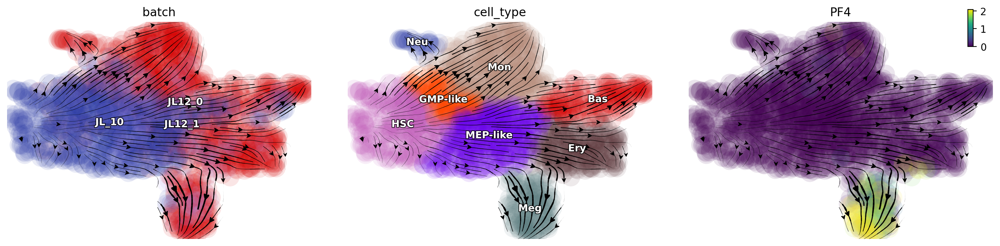

.. raw:: html

    

      
      
    

scNT-seq human hematopoiesis dynamics
=====================================

In this tutorial, we will demonstrate how to perform absolute total RNA
velocity analyses with the metabolic labeling datasets that was reported
in the dynamo Cell paper. This notebook reproduces the total RNA
velocity analyses reported in figure 3B of the original cell study. Note
that dynamo is equiped with the processed hematopoiesis dataset produced
following the steps presented in this notebook. You can download the
processed data via ``dyn.sample_data.hematopoiesis``.

.. code:: ipython3

    %%capture
    
    import dynamo as dyn
    import pandas as pd
    import numpy as np
    import warnings
    
    warnings.filterwarnings("ignore")

First let us download the raw hematopoiesis data via
``dyn.sample_data.hematopoiesis_raw``. The\ ``new`` and ``total`` layers
correspond to the labeled RNA and total RNA and will be used for total
RNA velocity analyses estimation. Note that in order to ensure the
reproducibility, we will also included the umap embedding in
``.obsm['X_umap']`` generated previously.

.. code:: ipython3

    adata_hsc_raw = dyn.sample_data.hematopoiesis_raw()
    adata_hsc_raw

.. parsed-literal::

    AnnData object with n_obs × n_vars = 1947 × 26193
        obs: 'batch', 'cell_type', 'time'
        var: 'gene_name_mapping'
        uns: 'genes_to_use'
        obsm: 'X_umap'
        layers: 'new', 'spliced', 'total', 'unspliced'

We use the monocle recipe to preprocess the ``adata`` object.
Importantly, to ensure the reproducibility, we also use a predefined
gene list that includes the highly variable genes and known markers
genes based on previous reports (`Paul, cell,
2015 <https://pubmed.ncbi.nlm.nih.gov/26627738/>`__, `Weintrab, Science,
2020 <https://pubmed.ncbi.nlm.nih.gov/31974159/>`__, etc). The gene list
is stored in ``adata_hsc_raw.uns["genes_to_use"]`` of the hematopoiesis
raw dataset came with dynamo.

Note that the ``time`` key indicates the RNA metabolic labeling
duration. Since we labeled cells from the same harvest time point for a
single time pulse, so the experiment_type is set to be “one-shot”
(although we labeled cells at day 7 for 3 hours while cells at day 10
for 5 hours).

.. code:: ipython3

    selected_genes_to_use = adata_hsc_raw.uns["genes_to_use"]

.. code:: ipython3

    preprocessor = dyn.pp.Preprocessor(force_gene_list=selected_genes_to_use)
    preprocessor.config_monocle_recipe(adata_hsc_raw, n_top_genes=len(selected_genes_to_use))   
    preprocessor.filter_cells_by_outliers_kwargs["keep_filtered"] = True
    preprocessor.preprocess_adata_monocle(
        adata_hsc_raw,
        tkey="time",
        experiment_type="one-shot",
    )

.. parsed-literal::

    |-----> convert ensemble name to official gene name
    |-----? Your adata object uses non-official gene names as gene index. 
    Dynamo is converting those names to official gene names.

.. parsed-literal::

    INFO:biothings.client:[ Future queries will be cached in "/Users/xiaojieqiu/PycharmProjects/dynamo_local/pr_version/dynamo-release/debug/mygene_cache.sqlite" ]
    INFO:biothings.client:querying 1-1000...
    INFO:biothings.client:done.
    INFO:biothings.client:querying 1001-2000...
    INFO:biothings.client:done.
    INFO:biothings.client:querying 2001-3000...
    INFO:biothings.client:done.
    INFO:biothings.client:querying 3001-4000...
    INFO:biothings.client:done.
    INFO:biothings.client:querying 4001-5000...
    INFO:biothings.client:done.
    INFO:biothings.client:querying 5001-6000...
    INFO:biothings.client:done.
    INFO:biothings.client:querying 6001-7000...
    INFO:biothings.client:done.
    INFO:biothings.client:querying 7001-8000...
    INFO:biothings.client:done.
    INFO:biothings.client:querying 8001-9000...
    INFO:biothings.client:done.
    INFO:biothings.client:querying 9001-10000...
    INFO:biothings.client:done.
    INFO:biothings.client:querying 10001-11000...
    INFO:biothings.client:done.
    INFO:biothings.client:querying 11001-12000...
    INFO:biothings.client:done.
    INFO:biothings.client:querying 12001-13000...
    INFO:biothings.client:done.
    INFO:biothings.client:querying 13001-14000...
    INFO:biothings.client:done.
    INFO:biothings.client:querying 14001-15000...
    INFO:biothings.client:done.
    INFO:biothings.client:querying 15001-16000...
    INFO:biothings.client:done.
    INFO:biothings.client:querying 16001-17000...
    INFO:biothings.client:done.
    INFO:biothings.client:querying 17001-18000...
    INFO:biothings.client:done.
    INFO:biothings.client:querying 18001-19000...
    INFO:biothings.client:done.
    INFO:biothings.client:querying 19001-20000...
    INFO:biothings.client:done.
    INFO:biothings.client:querying 20001-21000...
    INFO:biothings.client:done.
    INFO:biothings.client:querying 21001-22000...
    INFO:biothings.client:done.
    INFO:biothings.client:querying 22001-23000...
    INFO:biothings.client:done.
    INFO:biothings.client:querying 23001-24000...
    INFO:biothings.client:done.
    INFO:biothings.client:querying 24001-25000...
    INFO:biothings.client:done.
    INFO:biothings.client:querying 25001-26000...
    INFO:biothings.client:done.
    INFO:biothings.client:querying 26001-26193...
    INFO:biothings.client:done.
    INFO:biothings.client:Finished.
    WARNING:biothings.client:4 input query terms found dup hits:	[('ENSG00000229425', 2), ('ENSG00000249738', 2), ('ENSG00000260788', 2), ('ENSG00000278903', 3)]
    WARNING:biothings.client:66 input query terms found no hit:	['ENSG00000112096', 'ENSG00000168078', 'ENSG00000189144', 'ENSG00000203812', 'ENSG00000215271', 'ENS
    INFO:biothings.client:Pass "returnall=True" to return complete lists of duplicate or missing query terms.

.. parsed-literal::

    |-----> [Preprocessor-monocle] completed [52.9206s]

.. code:: ipython3

    adata_hsc_raw.var.use_for_pca.sum()

.. parsed-literal::

    1754

.. code:: ipython3

    dyn.tl.reduceDimension(adata_hsc_raw)

.. parsed-literal::

    |-----> retrieve data for non-linear dimension reduction...
    |-----? adata already have basis umap. dimension reduction umap will be skipped! 
    set enforce=True to re-performing dimension reduction.
    |-----> Start computing neighbor graph...
    |-----------> X_data is None, fetching or recomputing...
    |-----> fetching X data from layer:None, basis:pca
    |-----> method arg is None, choosing methods automatically...
    |-----------> method ball_tree selected
    |-----> [UMAP] completed [0.1044s]

Estimate RNA velocity with the Model 2
--------------------------------------

In general, dynamo supports two major models for estimating kinetic
parameters and RNA velocity for tscRNA-seq data. The Model 2 doesn’t
consider RNA splicing while Monocle 3 does (see Fig. SI2. A).

Note that we also use labeling time to group cells for gene expression
smoothing via ``dyn.tl.moments``.

.. code:: ipython3

    dyn.tl.moments(adata_hsc_raw, group="time")

.. parsed-literal::

    |-----> calculating first/second moments...
    |-----> [moments calculation] completed [11.4238s]

Since we actually have unsplicing/splicing data in our adata, dynamo’s
preprocess module automatically recognizes this and then tag the
``adata`` to have both splicing and labeling information. In order to
use Model 2, here we purposely set ``has_splicing`` to be false, which
then considers labeling data (new/total) while ignores
unsplicing/splicing information.

Note that in order to ensure the reproducibility, we set
``one_shot_method="sci_fate", model="deterministic"`` but running with
default parameters will give you very similar results.

.. code:: ipython3

    adata_hsc_raw.uns["pp"]["has_splicing"] = False
    dyn.tl.dynamics(adata_hsc_raw, group="time", one_shot_method="sci_fate", model="deterministic");

.. parsed-literal::

    |-----> calculating first/second moments...
    |-----> [moments calculation] completed [2.6312s]

.. parsed-literal::

    estimating gamma: 100%|████████████████████| 1754/1754 [00:07<00:00, 228.62it/s]
    estimating alpha: 100%|██████████████████| 1754/1754 [00:00<00:00, 93060.56it/s]

.. parsed-literal::

    |-----> calculating first/second moments...
    |-----> [moments calculation] completed [1.8938s]

.. parsed-literal::

    estimating gamma: 100%|████████████████████| 1754/1754 [00:05<00:00, 326.59it/s]
    estimating alpha: 100%|██████████████████| 1754/1754 [00:00<00:00, 99647.95it/s]

Next, because we actually quantified both the labeling and splicing
information, we used the second formula that involves both splicing and
labeling data to define total RNA velocity
(:math:`\dot{r} = n / (1 - e^{-rt}) \cdot r - \gamma s`) where
:math:`r, n, t, \gamma, s` are total RNA, new RNA, labeling time,
splicing rate and spliced RNA respectively.

Once the high-dimensional total RNA velocities are calculated, we will
then projected them to two-dimensional UMAP space and visualized with
the streamline plot, using dynamo with default parameters
(``dyn.tl.cell_velocities``).

.. code:: ipython3

    adata_hsc_raw.obs.time.unique()

.. parsed-literal::

    array([3, 5])

.. code:: ipython3

    adata_hsc_raw

.. parsed-literal::

    AnnData object with n_obs × n_vars = 1947 × 21595
        obs: 'batch', 'cell_type', 'time', 'nGenes', 'nCounts', 'pMito', 'pass_basic_filter', 'unspliced_Size_Factor', 'initial_unspliced_cell_size', 'total_Size_Factor', 'initial_total_cell_size', 'new_Size_Factor', 'initial_new_cell_size', 'spliced_Size_Factor', 'initial_spliced_cell_size', 'Size_Factor', 'initial_cell_size', 'ntr'
        var: 'gene_name_mapping', 'query', 'scopes', '_id', '_score', 'symbol', 'nCells', 'nCounts', 'pass_basic_filter', 'log_cv', 'score', 'log_m', 'frac', 'use_for_pca', 'ntr', 'time_3_alpha', 'time_3_beta', 'time_3_gamma', 'time_3_half_life', 'time_3_alpha_b', 'time_3_alpha_r2', 'time_3_gamma_b', 'time_3_gamma_r2', 'time_3_gamma_logLL', 'time_3_delta_b', 'time_3_delta_r2', 'time_3_bs', 'time_3_bf', 'time_3_uu0', 'time_3_ul0', 'time_3_su0', 'time_3_sl0', 'time_3_U0', 'time_3_S0', 'time_3_total0', 'time_3_beta_k', 'time_3_gamma_k', 'time_5_alpha', 'time_5_beta', 'time_5_gamma', 'time_5_half_life', 'time_5_alpha_b', 'time_5_alpha_r2', 'time_5_gamma_b', 'time_5_gamma_r2', 'time_5_gamma_logLL', 'time_5_bs', 'time_5_bf', 'time_5_uu0', 'time_5_ul0', 'time_5_su0', 'time_5_sl0', 'time_5_U0', 'time_5_S0', 'time_5_total0', 'time_5_beta_k', 'time_5_gamma_k', 'use_for_dynamics'
        uns: 'genes_to_use', 'pp', 'velocyto_SVR', 'feature_selection', 'PCs', 'explained_variance_ratio_', 'pca_mean', 'neighbors', 'dynamics'
        obsm: 'X_umap', 'X_pca'
        layers: 'new', 'spliced', 'total', 'unspliced', 'X_total', 'X_unspliced', 'X_new', 'X_spliced', 'M_u', 'M_uu', 'M_s', 'M_us', 'M_t', 'M_tt', 'M_n', 'M_tn', 'M_ss', 'M_nn', 'velocity_N', 'velocity_T'
        obsp: 'distances', 'connectivities', 'moments_con'

We have two time points in hsc dataset. Here we split the dataset based
on time points and prepare data for calculation next.

.. code:: ipython3

    pca_genes = adata_hsc_raw.var.use_for_pca
    new_expr = adata_hsc_raw[:, pca_genes].layers["M_n"]
    time_3_gamma = adata_hsc_raw[:, pca_genes].var.time_3_gamma.astype(float)
    time_5_gamma = adata_hsc_raw[:, pca_genes].var.time_5_gamma.astype(float)
    
    t = adata_hsc_raw.obs.time.astype(float)
    M_s = adata_hsc_raw.layers["M_s"][:, pca_genes]
    
    time_3_cells = adata_hsc_raw.obs.time == 3
    time_5_cells = adata_hsc_raw.obs.time == 5

Next, we will calculate ``total RNA velocity`` according to

.. math:: \dot{r} = n / (1 - e^{-rt}) \cdot r - \gamma s

.. code:: ipython3

    def alpha_minus_gamma_s(new, gamma, t, M_s):
        # equation: alpha = new / (1 - e^{-rt}) * r
        alpha = new.A.T / (1 - np.exp(-gamma.values[:, None] * t.values[None, :])) * gamma.values[:, None]
        
        gamma_s = gamma.values[:, None] * M_s.A.T
        alpha_minus_gamma_s = alpha - gamma_s
        return alpha_minus_gamma_s
    
    time_3_velocity_n = alpha_minus_gamma_s(new_expr[time_3_cells, :], time_3_gamma, t[time_3_cells], M_s[time_3_cells, :])
    time_5_velocity_n = alpha_minus_gamma_s(new_expr[time_5_cells, :], time_5_gamma, t[time_5_cells], M_s[time_5_cells, :])
    
    velocity_n = adata_hsc_raw.layers["velocity_N"].copy()
    
    valid_velocity_n = velocity_n[:, pca_genes].copy()
    valid_velocity_n[time_3_cells, :] = time_3_velocity_n.T
    valid_velocity_n[time_5_cells, :] = time_5_velocity_n.T
    velocity_n[:, pca_genes] = valid_velocity_n.copy()
    
    adata_hsc_raw.layers["velocity_alpha_minus_gamma_s"] = velocity_n.copy()

The results are stored in
``adata_hsc_raw.layers["velocity_alpha_minus_gamma_s"]``, which can be
further projected to low dimension space for visualization.

.. code:: ipython3

    dyn.tl.cell_velocities(
        adata_hsc_raw,
        enforce=True,
        X=adata_hsc_raw.layers["M_t"],
        V=adata_hsc_raw.layers["velocity_alpha_minus_gamma_s"],
        method="cosine",
    );

Now let us plot the total RNA stream line plot and visualize the PF4
gene expression on the UMAP space with default parameters. This
reproduces total RNA velocity streamline plot in Figure 3B and Figure
3C.

.. code:: ipython3

    dyn.pl.streamline_plot(
        adata_hsc_raw,
        color=["batch", "cell_type", "PF4"],
        ncols=4,
        basis="umap",
    )

Here we can also visualize the total RNA phase diagram in Figure 3E
using dynamo with default settings

